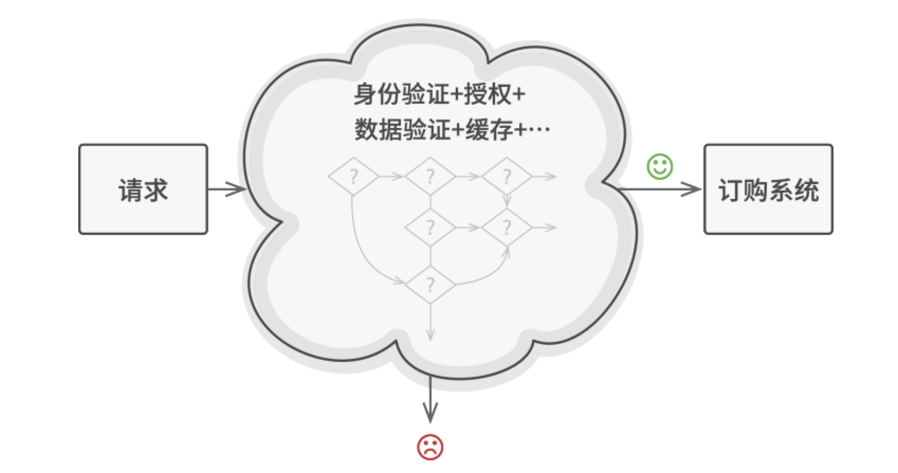
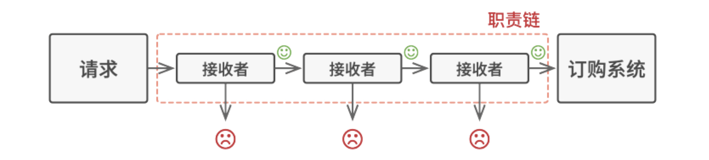
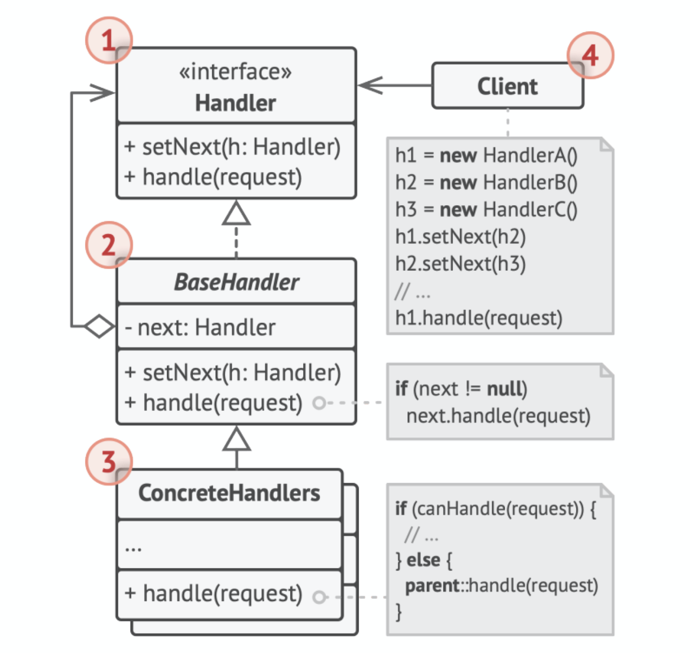

# 责任链模式（Chain of Responsibility）

## 别名

命令链（Chain of Command）。

## 定义

责任链是一种行为设计模式，允许你将请求沿着处理者链进行发送。收到请求后，每个处理者均可对请求进行处理，或将其传递给链上的下个处理者。

## 前言

#### 1. 问题

假如你正在开发一个在线订购系统。你希望对系统访问进行限制，只允许认证用户创建订单。此外，拥有管理权限的用户也拥有所有订单的完全访问权限。

简单规划后，你会意识到这些检查必须依次进行。只要接收到包含用户凭据的请求，应用程序就可尝试对进入系统的用户进行认证。但如果由于用户凭据不正确而导致认证失败，那就没有必要进行后续检查了。



随着功能不断迭代，检查代码逐渐变得越来越混乱，修改某个检查步骤有时会影响其他的检查步骤。最糟糕的是，当你希望复用这些检查步骤来保护其他系统组件时，你只能复制部分代码，因为这些组件只需要部分而非全部的检查步骤。

系统会变得让人非常费解，而且其维护成本也会激增。你在艰难地和这些代码共处一段时间后，有一天终于决定对整个系统进行重构。

#### 2. 解决方案

与许多其他行为设计模式一样，「责任链模式」会将特定行为转换为被称作处理者的独立对象。在上述示例中，每个检查步骤都可被抽取为仅有单个方法的类，并执行检查操作。请求及其数据则会被作为参数传递给该方法。

模式建议你将这些处理者连成一条链。**链上的每个处理者都有一个成员变量来保存对于下一处理者的引用**。除了处理请求外，处理者还负责沿着链传递请求。请求会在链上移动，直至所有处理者都有机会对其进行处理。

**最重要的是：处理者可以决定不再沿着链传递请求，这可高 效地取消所有后续处理步骤。**

在我们的订购系统示例中，处理者会在进行请求处理工作后决定是否继续沿着链传递请求。如果请求中包含正确的数据，所有处理者都将执行自己的主要行为，无论该行为是身份验证还是数据缓存。



不过还有一种稍微不同的方式（也是更经典一种），那就是处理者接收到请求后自行决定是否能够对其进行处理。如果自己能够处理，处理者就不再继续传递请求。因此在这种情况下，每个请求要么最多有一个处理者对其进行处理，要么没有任何处理者对其进行处理。在处理图形用户界面元素栈中的事件时，这种方式非常常见。

**所有处理者类均实现同一接口是关键所在。**每个具体处理者仅关心下一个包含 execute 执行 方法的处理者。 这样一来，你就可以在运行时使用不同的处理者来创建链，而无需将相关代码与处理者的具体类进行耦合。

## 结构



1. 处理者（Handler）声明了所有具体处理者的通用接口。该接口通常仅包含单个方法用于请求处理，但有时其还会包含一个设置链上下个处理者的方法。
2. 基础处理者（Base Handler）是一个可选的类， 你可以将所有处理者共用的样本代码放置在其中。通常情况下，该类中定义了一个保存对于下个处理者引用的成员变量。客户端可通过将处理者传递给上个处理者的构造函数或设定方法来创建链。该类还可以实现默认的处理行为：确定下个处理者存在后再将请求传递给它。
3. 具体处理者（Concrete Handlers）包含处理请求的实际代码。每个处理者接收到请求后，都必须决定是否进行处理，以及是否沿着链传递请求。处理者通常是独立且不可变的，需要通过构造函数一次性地获得所有必要地数据。
4. 客户端（Client）可根据程序逻辑一次性或者动态地生成链。值得注意的是，请求可发送给链上的任意一个处理者，而非必须是第一个处理者。

## 适用场景

* 当程序需要使用不同方式处理不同种类请求，而且请求类型和顺序预先未知时，可以使用责任链模式。

该模式能将多个处理者连接成一条链。接收到请求后，它会“询问”每个处理者是否能够对其进行处理。这样所有处理者都有机会来处理请求。

* 当必须按顺序执行多个处理者时，可以使用该模式。

无论你以何种顺序将处理者连接成一条链，所有请求都会严格按照顺序通过链上的处理者。

* 如果所需处理者及其顺序必须在运行时进行改变，可以使用责任链模式。该类需要有一个成员变量来存储指向链上下个处理者的引用。你可以将其设置为不可变类。但如果你打算在运行时对链进行改变，则需要定义一个设定方法来修改引用成员变量的值。

如果在处理者类中有对引用成员变量的设定方法，你将能动态地插入和移除处理者，或者改变其顺序。

## 实现方式

1. 声明处理者接口并描述请求处理方法的签名。确定客户端如何将请求数据传递给方法。最灵活的方式是将请求转换为对象，然后将其以参数的形式传递给处理函数。
2. 为了在具体处理者中消除重复的样本代码，你可以根据处理者接口创建抽象处理者基类。该类需要有一个成员变量来存储指向链上下个处理者的引用。你可以将其设置为不可变类。但如果你打算在运行时对链进行改变，则需要定义一个设定方法来修改引用成员变量的值。为了使用方便，你还可以实现处理方法的默认行为。如果还有剩余对象，该方法会将请求传递给下个对象。具体处理者还能够通过调用父对象的方法来使用这一行为。
3. 依次创建具体处理者子类并实现其处理方法。每个处理者在 接收到请求后都必须做出两个决定：
   1. 是否自行处理这个请求。
   2. 是否将该请求沿着链进行传递。
4. 客户端可以自行组装链，或者从其他对象处获得预先组装好的链。在后一种情况下，你必须实现工厂类以根据配置或环境设置来创建链。
5. 客户端可以触发链中的任意处理者，而不仅仅是第一个。请求将通过链进行传递，直至某个处理者拒绝继续传递，或者请求到达链尾。
6. 由于链的动态性，客户端需要准备好处理以下情况：
   1. 链中可能只有单个链接。
   2. 部分请求可能无法到达链尾。
   3. 其他请求可能直到链尾都未被处理。

## 优点

* 你可以控制请求处理的顺序。
* 单一职责原则。你可对发起操作和执行操作的类进行解耦。
* 开闭原则。你可以在不更改现有代码的情况下在程序中新增 处理者。

## 缺点

部分请求可能未被处理。

## 与其他模式的关系

* 责任链、命令、中介者和观察者用于处理请求发送者和接收者之间的不同连接方式：
  * 责任链按照顺序将请求动态传递给一系列的潜在接收者，直至其中一名接收者对请求进行处理。
  * 命令在发送者和请求者之间建立单向连接。
  * 中介者清除了发送者和请求者之间的直接连接，强制它们通过一个中介对象进行间接沟通。
  * 观察者允许接收者动态地订阅或取消接收请求。
* 责任链通常和组合模式结合使用。在这种情况下，叶组件接收到请求后，可以将请求沿包含全体父组件的链一直传递至对象树的底部。
* 责任链的管理者可使用命令模式实现。在这种情况下，你可以对由请求代表的同一个上下文对象执行许多不同的操作。还有另外一种实现方式，那就是请求自身就是一个命令对象。在这种情况下，你可以对由一系列不同上下文连接而成的链执行相同的操作。
* 责任链和装饰模式的类结构非常相似。两者都依赖递归组合将需要执行的操作传递给一系列对象。但是，两者有几点重要的不同之处。责任链的管理者可以相互独立地执行一切操作，还可以随时停止传递请求。另一方面，各种装饰可以在遵循基本接口的情况下扩展对象的行为。此外，装饰无法中断请求的传递。

## 实例

在本例中，员工申请处理票据需要上报给上级，如果上级无权处理就上报给更高的上级。

Handler.h：

```c++
#ifndef HANDLER_H_
#define HANDLER_H_

// 抽象处理者, 在C++中是抽象基类
class ApproverInterface {
 public:
    // 添加上级
    virtual void setSuperior(ApproverInterface* superior) = 0;
    // 处理票据申请, 参数是票据面额
    virtual void handleRequest(double amount) = 0;
};

#endif  // HANDLER_H_
```

BaseHandler.h：

```c++
#ifndef BASE_HANDLER_H_
#define BASE_HANDLER_H_

#include <string>
#include "Handler.h"

class BaseApprover : public ApproverInterface {
 public:
    BaseApprover(double mpa, std::string n) : max_processible_amount_(mpa), name_(n), superior_(nullptr) {}
    // 设置上级
    void setSuperior(ApproverInterface* superior) {
        superior_ = superior;
    }
    // 处理票据
    void handleRequest(double amount) {
        // 可处理时直接处理即可
        if (amount <= max_processible_amount_) {
            printf("%s处理了该票据, 票据面额:%f\n", name_.c_str(), amount);
            return;
        }
        // 无法处理时移交给上级
        if (superior_ != nullptr) {
            printf("%s无权处理, 转交上级...\n", name_.c_str());
            superior_->handleRequest(amount);
            return;
        }
        // 最上级依然无法处理时报错
        printf("无人有权限处理该票据, 票据金额:%f\n", name_.c_str(), amount);
    }

 private:
    double max_processible_amount_;  // 可处理的最大面额
    std::string name_;
    ApproverInterface* superior_;
};

#endif  // BASE_HANDLER_H_
```

ConcreteHandler.h：

```c++
#ifndef CONCRETE_HANDLER_H_
#define CONCRETE_HANDLER_H_

#include <string>
#include <cstdio>
#include "BaseHandler.h"

// 具体处理者: 组长(仅处理面额<=10的票据)
class GroupLeader : public BaseApprover {
 public:
    explicit GroupLeader(std::string name) : BaseApprover(10, name) {}
};

// 具体处理者: 经理(仅处理面额<=100的票据)
class Manager : public BaseApprover {
 public:
    explicit Manager(std::string name) : BaseApprover(100, name) {}
};


// 具体处理者: 老板(仅处理面额<=1000的票据)
class Boss : public BaseApprover {
 public:
    explicit Boss(std::string name) : BaseApprover(1000, name) {}
};


#endif  // CONCRETE_HANDLER_H_
```

main.cpp：

```c++
#include "ConcreteHandler.h"

int main() {
    // 请求处理者: 组长、经理和老板
    GroupLeader* group_leader = new GroupLeader("张组长");
    Manager* manager = new Manager("王经理");
    Boss* boss = new Boss("李老板");

    // 设置上级
    group_leader->setSuperior(manager);
    manager->setSuperior(boss);

    // 不同面额的票据统一先交给组长审批
    group_leader->handleRequest(8);
    group_leader->handleRequest(88);
    group_leader->handleRequest(888);
    group_leader->handleRequest(8888);

    delete group_leader;
    delete manager;
    delete boss;

    return 0;
}
```

编译运行：

```bash
$g++ main.cpp -std=c++11 -o chainofresponsibility
$./chainofresponsibility 
张组长处理了该票据, 票据面额:8.000000
张组长无权处理, 转交上级...
王经理处理了该票据, 票据面额:88.000000
张组长无权处理, 转交上级...
王经理无权处理, 转交上级...
李老板处理了该票据, 票据面额:888.000000
张组长无权处理, 转交上级...
王经理无权处理, 转交上级...
无人有权限处理该票据, 票据金额:8888.000000
```

