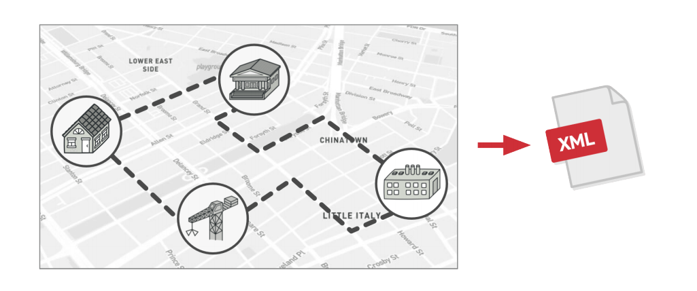
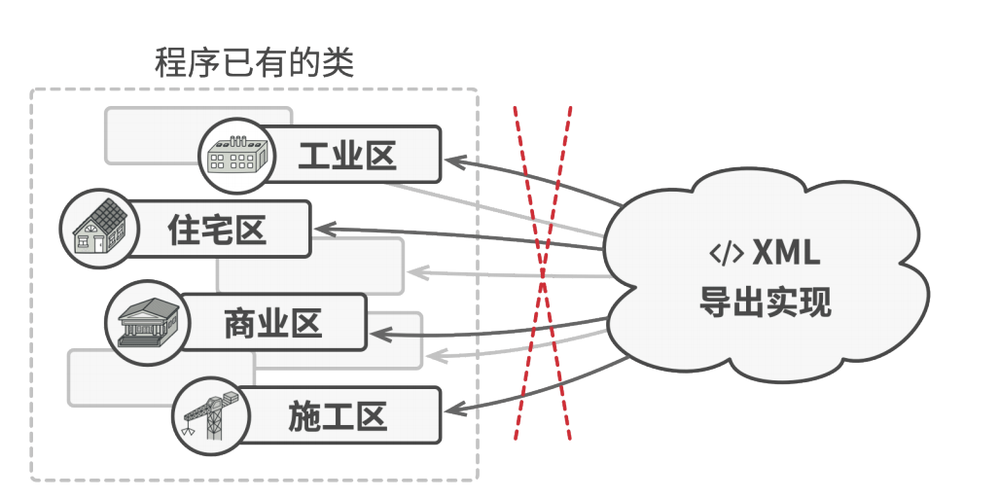
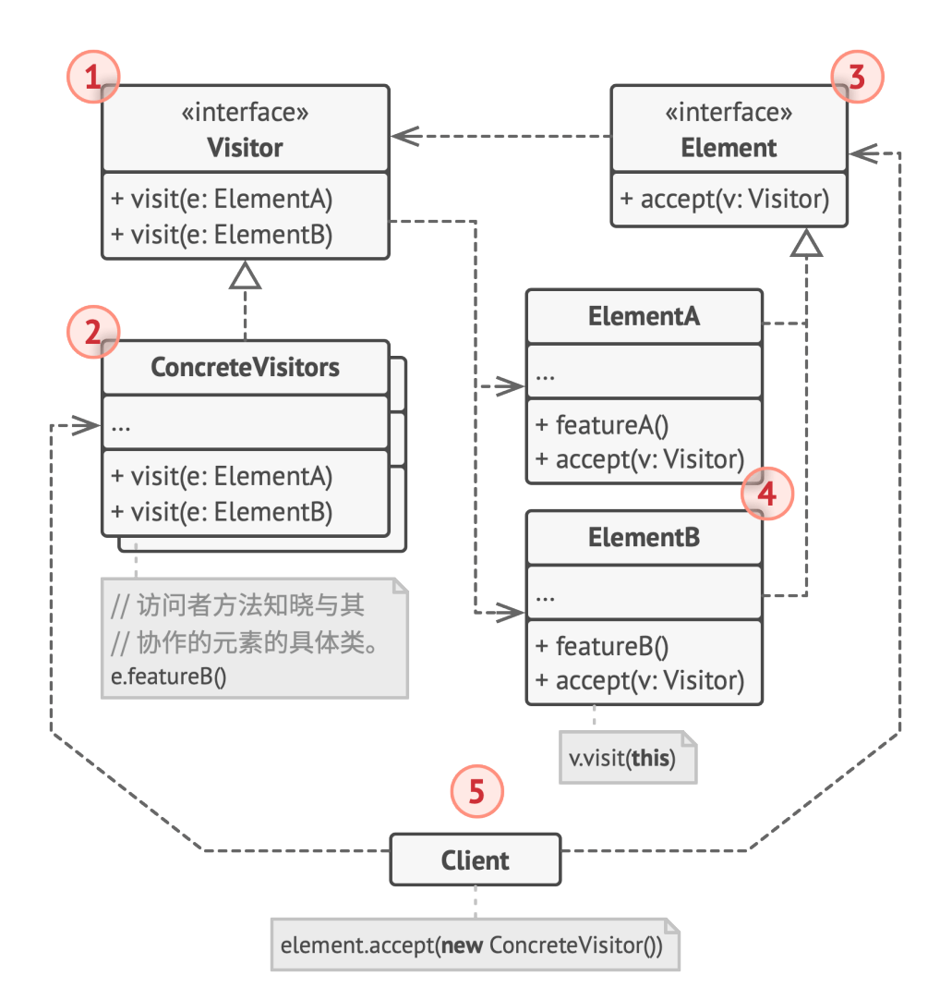

# 访问者模式（Vistor）

## 定义

**访问者**是一种行为设计模式，它能将算法与其所作用的对象隔离开来。

## 前言

#### 1. 问题

假如你的团队开发了一款能够使用巨型图像中地理信息的应用程序。图像中的每个节点既能代表复杂实体（例如一座城市）， 也能代表更精细的对象（例如工业区和旅游景点等）。如果节点代表的真实对象之间存在公路，那么这些节点就会相互连接。在程序内部，每个节点的类型都由其所属的类来表示，每个特定的节点则是一个对象。



一段时间后， 你接到了实现将图像导出到 XML 文件中的任务。这些工作最初看上去非常简单。你计划为每个节点类添加导出函数，然后递归执行图像中每个节点的导出函数。解决方案简单且优雅：使用多态机制可以让导出方法的调用代码不会和具体的节点类相耦合。 

但你不太走运，系统架构师拒绝批准对已有节点类进行修改。他认为这些代码已经是产品了，不想冒险对其进行修改，因1为修改可能会引入潜在的缺陷。



此外，他还质疑在节点类中包含导出 XML 文件的代码是否有意义。这些类的主要工作是处理地理数据。导出 XML 文件的代码放在这里并不合适。

还有另一个原因，那就是在此项任务完成后，营销部门很有可能会要求程序提供导出其他类型文件的功能，或者提出其他奇怪的要求。这样你很可能会被迫再次修改这些重要但脆弱的类。

#### 2. 解决方案

访问者模式建议将新行为放入一个名为访问者的独立类中，而不是试图将其整合到已有类中。现在，需要执行操作的原始对象将作为参数被传递给访问者中的方法，让方法能访问对象所包含的一切必要数据。

它使用了一种名为**双分派**的技巧，不使用累赘的条件语句也可下执行正确的方法。与其让客户端来选择调用正确版本的方法，不如将选择权委派给作为参数传递给访问者的对象。由于该对象知晓其自身的类，因此能更自然地在访问者中选出正确的方法。它们会“接收”一个访问者并告诉其应执行的访问者方法。

```c++
// 客户端代码
for (auto node : graph) {
    node->accpet(exportVistor);
}

// 城市
class City {
 public:
    void accept(Vistor *v) {
        v->doForCity(this);
    }
    // ...
};

// 工业区
class Industry {
 public:
    void accept(Vistor *v) {
        v->doForIndustry(this);
    }
    // ...
};
```

我承认最终还是修改了节点类，但毕竟改动很小，且使得我们能够在后续进一步添加行为时无需再次修改代码。

现在，如果我们抽取出所有访问者的通用接口，所有已有的节点都能与我们在程序中引入的任何访问者交互。如果需要引入与节点相关的某个行为，你只需要实现一个新的访问者类即可。

## 结构



1. **访问者**（Visitor）接口声明了一系列以对象结构的具体元素为参数的访问者方法。如果编程语言支持重载，这些方法的名称可以是相同的，但是其参数一定是不同的。 
2. **具体访问者**（Concrete Visitor）会为不同的具体元素类实现相同行为的几个不同版本。
3. **元素**（Element） 接口声明了一个方法来“接收” 访问者。该方法必须有一个参数被声明为访问者接口类型。
4. **具体元素**（Concrete Element）必须实现接收方法。 该方法的目的是根据当前元素类将其调用重定向到相应访问者的方法。请注意，即使元素基类实现了该方法，所有子类都必须对其进行重写并调用访问者对象中的合适方法。
5. **客户端**（Client）通常会作为集合或其他复杂对象（例如一个**组合**树）的代表。 客户端通常不知晓所有的具体元素类，因为它们会通过抽象接口与集合中的对象进行交互。

## 适用场景

* 如果你需要对一个复杂对象结构（例如对象树）中的所有元素执行某些操作，可使用访问者模式。

访问者模式通过在访问者对象中为多个目标类提供相同操作的变体，让你能在属于不同类的一组对象上执行同一操作。

* 可使用访问者模式来清理辅助行为的业务逻辑。

该模式会将所有非主要的行为抽取到一组访问者类中，使得程序的主要类能更专注于主要的工作。

* 当某个行为仅在类层次结构中的一些类中有意义，而在其他类中没有意义时，可使用该模式。

你可将该行为抽取到单独的访问者类中，只需实现接收相关类的对象作为参数的访问者方法并将其他方法留空即可。

## 实现方式

1. 在访问者接口中声明一组“访问”方法，分别对应程序中的每个具体元素类。 
2. 声明元素接口。如果程序中已有元素类层次接口，可在层次结构基类中添加抽象的“接收”方法。该方法必须接受访问者对象作为参数。
3. 在所有具体元素类中实现接收方法。这些方法必须将调用重定向到当前元素对应的访问者对象中的访问者方法上。
4. 元素类只能通过访问者接口与访问者进行交互。不过访问者必须知晓所有的具体元素类，因为这些类在访问者方法中都被作为参数类型引用。
5. 为每个无法在元素层次结构中实现的行为创建一个具体访问者类并实现所有的访问者方法。你可能会遇到访问者需要访问元素类的部分私有成员变量的情况。在这种情况下，你要么将这些变量或方法设为公有，这将破坏元素的封装；要么将访问者类嵌入到元素类中。后一种方式只有在支持嵌套类的编程语言中才可能实现。
6. 客户端必须创建访问者对象并通过“接收”方法将其传递给元素。

## 优点

* 开闭原则。你可以引入在不同类对象上执行的新行为，且无需对这些类做出修改。 
* 单一职责原则。可将同一行为的不同版本移到同一个类中。
* 访问者对象可以在与各种对象交互时收集一些有用的信息。当你想要遍历一些复杂的对象结构（例如对象树），并在结构中的每个对象上应用访问者时，这些信息可能会有所帮助。

## 缺点

* 每次在元素层次结构中添加或移除一个类时，你都要更新所有的访问者。
* 在访问者同某个元素进行交互时，它们可能没有访问元素私有成员变量和方法的必要权限。

## 与其他模式关系

* 你可以将**访问者**视为**命令**模式的加强版本，其对象可对不同类的多种对象执行操作。 
* 你可以使用**访问者**对整个**组合**树执行操作。 
* 可以同时使用**访问者**和**迭代器**来遍历复杂数据结构，并对其中的元素执行所需操作，即使这些元素所属的类完全不同。 

## 实例

Visitor.h：

```c++
#ifndef VISTOR_H_
#define VISTOR_H_

#include <string>

class Apple;
class Book;

// 抽象访问者
class Vistor {
 public:
    void set_name(std::string name) {
        name_ = name;
    }

    virtual void visit(Apple *apple) = 0;
    virtual void visit(Book *book) = 0;

 protected:
    std::string name_;
};

#endif  // VISTOR_H_
```

ConcreteVisitor.h：

```c++
#ifndef CONCRETE_VISTOR_H_
#define CONCRETE_VISTOR_H_

#include <iostream>
#include "Visitor.h"

// 具体访问者类: 顾客
class Customer : public Vistor {
 public:
    void visit(Apple *apple) {
        std::cout << "顾客" << name_ << "挑选苹果。" << std::endl;
    }

    void visit(Book *book) {
        std::cout << "顾客" << name_ << "买书。" << std::endl;
    }
};

// 具体访问者类： 收银员
class Saler : public Vistor {
 public:
    void visit(Apple *apple) {
        std::cout << "收银员" << name_ << "给苹果过称, 然后计算价格。" << std::endl;
    }

    void visit(Book *book) {
        std::cout << "收银员" << name_ << "计算书的价格。" << std::endl;
    }
};

#endif  // CONCRETE_VISTOR_H_
```

Element.h：

```c++
#ifndef ELEMENT_H_
#define ELEMENT_H_

#include "Visitor.h"

// 抽象元素类
class Product {
 public:
    virtual void accept(Vistor *vistor) = 0;
};

#endif  // ELEMENT_H_
```

ConcreteElement.h：

```c++
#ifndef CONCRETE_ELEMENT_H_
#define CONCRETE_ELEMENT_H_

#include "Element.h"

// 具体产品类: 苹果
class Apple : public Product {
 public:
    void accept(Vistor *vistor) override {
        vistor->visit(this);
    }
};

// 具体产品类: 书籍
class Book : public Product {
 public:
    void accept(Vistor *vistor) override {
        vistor->visit(this);
    }
};


#endif  // CONCRETE_ELEMENT_H_
```

Client.h：

```c++
#ifndef CLIENT_H_
#define CLIENT_H_

#include <list>
#include "Visitor.h"
#include "Element.h"

// 购物车
class ShoppingCart {
 public:
    void accept(Vistor *vistor) {
        for (auto prd : prd_list_) {
            prd->accept(vistor);
        }
    }

    void addProduct(Product *product) {
        prd_list_.push_back(product);
    }

    void removeProduct(Product *product) {
        prd_list_.remove(product);
    }

 private:
    std::list<Product*> prd_list_;
};

#endif  // CLIENT_H_
```

main.cpp：

```c++
#include "Client.h"
#include "ConcreteElement.h"
#include "ConcreteVisitor.h"

int main() {
    Book book;
    Apple apple;
    ShoppingCart basket;

    basket.addProduct(&book);
    basket.addProduct(&apple);

    Customer customer;
    customer.set_name("小张");
    basket.accept(&customer);

    Saler saler;
    saler.set_name("小杨");
    basket.accept(&saler);

    return 0;
}
```

编译运行：

```bash
$g++ -g main.cpp -o vistor -std=c++11
$./vistor 
顾客小张买书。
顾客小张挑选苹果。
收银员小杨计算书的价格。
收银员小杨给苹果过称, 然后计算价格。
```

