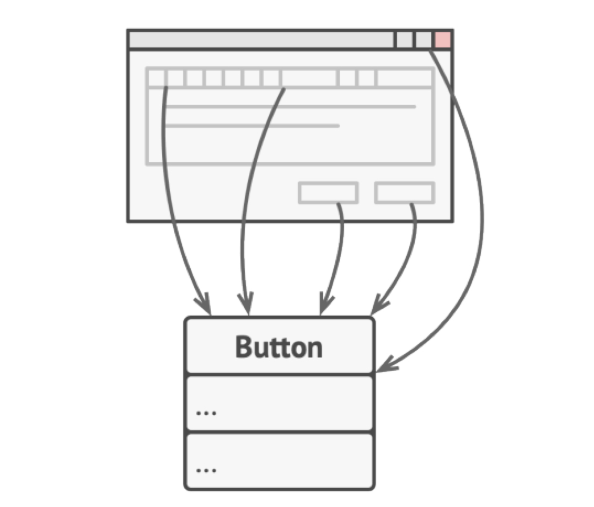
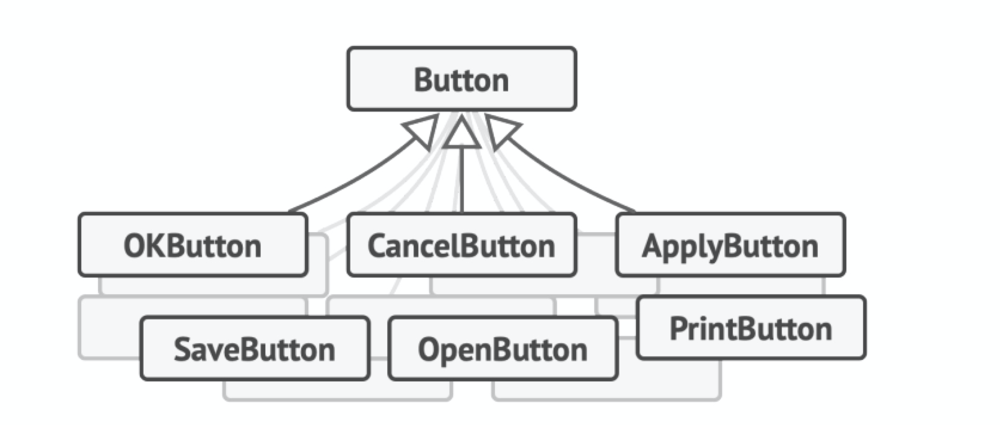
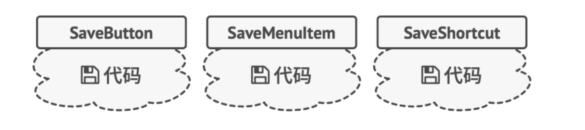
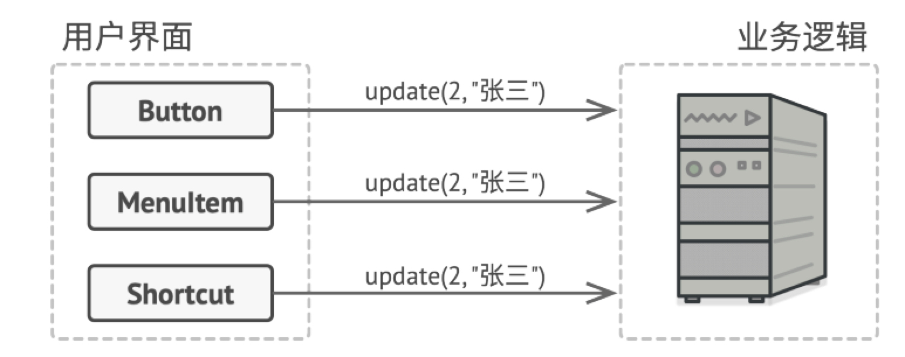
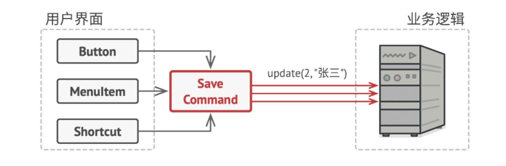
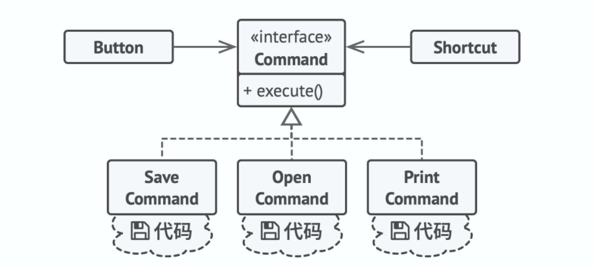
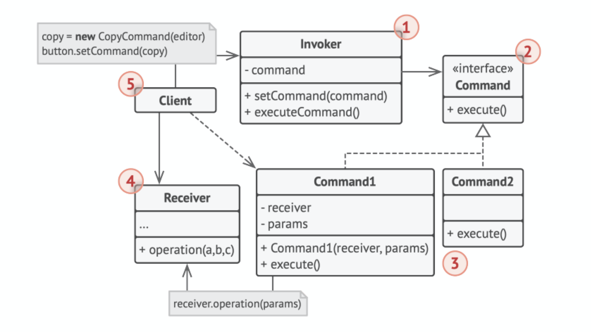

# 命令模式（Command）

## 别名

* 动作（Action）
* 事务（Transaction）

## 定义

命令是一种行为设计模式，它可将请求转换为一个包含与请求相关的所有信息的独立对象。该转换让你能根据不同的请求将方法参数化、延迟请求执行或将其放入队列中，且能实现可撤销操作。

## 前言

#### 1. 问题

假如你正在开发一款新的文字编辑器，当前的任务是创建一个包含多个按钮的工具栏，并让每个按钮对应编译器的不同操作。你创建了一个「Button」类。它不仅用于生成工具栏上的按钮，还可用于生成各种对话框的通用按钮。



尽管所有按钮看上去都很相似，但它们可以完成不同的操作（打开、保存、打印和应用等）。你会在哪里放置这些按钮的点击处理代码呢？最简单的解决方案是在使用按钮的每个地方都创建大量的子类。这些子类中包含按钮点击后必须执行的代码。



你很快就意识到这种方式有严重缺陷。首先，你创建了大量的子类，当每次修改基类 按钮 时，你都有可能需要修改所有子类的代码。简单来说，GUI 代码以一种拙劣的方式依赖于业务逻辑中的不稳定代码。

还有另外一个问题最难办。复制/粘贴文字等操作可能会在多个地方被调用。例如用户可以点击工具栏上的“复制”按钮，或者通过右键菜单复制一些文字，又或者直接使用键盘上的`Ctrl+C`。此时你要么需要将操作代码复制进许多个类中，要么需要让右键菜单依赖于按钮，而后者是更糟糕的选择。



#### 2. 解决方案

优秀的软件设计通常会将关注点进行分离，而这往往会导致软件的分层。最常见的例子：一层负责用户图像界面；另一层负责业务逻辑。GUI 层负责在屏幕上渲染美观的图形，捕获所有输入并显示用户和程序工作的结果。当需要完成一些重要内容时（比如计算月球轨道或撰写年度报告），GUI 层则会将工作委派给业务逻辑底层。

这在代码中看上去就像这样：一个 GUI 对象传递一些参数来调用一个业务逻辑对象。这个过程通常被描述为一个对象发送请求给另一个对象。



命令模式建议将请求的所有细节（例如调用的对象、方法名称和参数列表）抽取出来组成命令类，该类中仅包含一个触发请求的方法。

命令对象负责连接不同的 GUI 和业务逻辑对象。此后，GUI对象无需了解业务逻辑对象是否获得了请求，也无需了解其对请求进行处理的方式。GUI 对象触发命令即可，命令对象会自行处理所有细节工作。



下一步是让所有命令实现相同的接口。该接口通常只有一个没有任何参数的执行方法，让你能在不和具体命令类耦合的情况下使用同一请求发送者执行不同命令。此外还有额外的好处，现在你能在运行时切换连接至发送者的命令对象，以此改变发送者的行为。

你可能会注意到遗漏的一块拼图——请求的参数。GUI 对象可以给业务层对象提供一些参数。但执行命令方法没有任何参数，所以我们如何将请求的详情发送给接收者呢？答案是：使用数据对命令进行预先配置，或者让其能够自行获取数据。



让我们回到文本编辑器。应用命令模式后，我们不再需要任何按钮子类来实现点击行为。我们只需在「Button」基类中添加一个成员变量来存储对于命令对象的引用，并在点击后执行该命令即可。

你需要为每个可能的操作实现一系列命令类，并且根据按钮所需行为将命令和按钮连接起来。其他菜单、快捷方式或整个对话框等 GUI 元素都可以通过 同方式来实现。当用户与 GUI 元素交互时，与其连接的命令将会被执行。现在你很可能已经猜到了，与相同操作相关的元素将会被连接到相同的命令，从而避免了重复代码。

最后，命令成为了减少 GUI 和业务逻辑层之间耦合的中间层。而这仅仅是命令模式所提供的一小部分好处！


## 结构



1. 发送者（Sender）——亦称“触发者（Invoker）”——类负责对请求进行初始化，其中必须包含一个成员变量来存储对于命令对象的引用。发送者触发命令，而不向接收者直接发送请求。注意，发送者并不负责创建命令对象：它通常会通过构造函数从客户端处获得预先生成的命令。
2. 命令（Command）接口通常仅声明一个执行命令的方法。
3. 具体命令（Concrete Commands）会实现各种类型的请求。具体命令自身并不完成工作，而是会将调用委派给一个业务逻辑对象。但为了简化代码，这些类可以进行合并。接收对象执行方法所需的参数可以声明为具体命令的成员变量。你可以将命令对象设为不可变，仅允许通过构造函数对这些成员变量进行初始化。
4. 接收者（Receiver）类包含部分业务逻辑。几乎任何对象都可以作为接收者。绝大部分命令只处理如何将请求传递到接收者的细节，接收者自己会完成实际的工作。
5. 客户端（Client）会创建并配置具体命令对象。客户端必须将包括接收者实体在内的所有请求参数传递给命令的构造函数。此后，生成的命令就可以与一个或多个发送者相关联了。

## 适用场景

* 如果你需要通过操作来参数化对象，可使用命令模式。

命令模式可将特定的方法调用转化为独立对象。这一改变也带来了许多有趣的应用：你可以将命令作为方法的参数进行传递、将命令保存在其他对象中，或者在运行时切换已连接的命令等。 

举个例子： 你正在开发一个 GUI 组件（例如上下文菜单），你希望用户能够配置菜单项，并在点击菜单项时触发操作。

* 如果你想要将操作放入队列中、操作的执行或者远程执行操作，可使用命令模式。

同其他对象一样，命令也可以实现序列化（序列化的意思是转化为字符串），从而能方便地写入文件或数据库中。一段时间后，该字符串可被恢复成为最初的命令对象。因此，你可以延迟或计划命令的执行。但其功能远不止如此！使用同样的方式，你还可以将命令放入队列、记录命令或者通过网络发送命令。

* 如果你想要实现操作回滚功能，可使用命令模式。

尽管有很多方法可以实现撤销和恢复功能，但命令模式可能是其中最常用的一种。

为了能够回滚操作，你需要实现已执行操作的历史记录功能。命令历史记录是一种包含所有已执行命令对象及其相关程序状态备份的栈结构。

这种方法有两个缺点。首先，程序状态的保存功能并不容易实现，因为部分状态可能是私有的。你可以使用备忘录模式来在一定程度上解决这个问题。其次，备份状态可能会占用大量内存。因此，有时你需要借助另一种实现方式：命令无需恢复原始状态，而是执行反向操作。反向操作也有代价：它可能会很难甚至是无法实现。

## 实现方式

1. 声明仅有一个执行方法的命令接口。
2. 抽取请求并使之成为实现命令接口的具体命令类。每个类都必须有一组成员变量来保存请求参数和对于实际接收者对象的引用。所有这些变量的数值都必须通过命令构造函数进行初始化。
3. 找到担任发送者职责的类。在这些类中添加保存命令的成员变量。发送者只能通过命令接口与其命令进行交互。发送者自身通常并不创建命令对象，而是通过客户端代码获取。
4. 修改发送者使其执行命令，而非直接将请求发送给接收者。
5. 客户端必须按照以下顺序来初始化对象：
   1. 创建接收者。
   2. 创建命令，如有需要可将其关联至接收者。
   3. 创建发送者并将其与特定命令关联。

## 优点

* 单一职责原则。你可以解耦触发和执行操作的类。
* 开闭原则。你可以在不修改已有客户端代码的情况下在程序中创建新的命令。
* 你可以实现撤销和恢复功能。
* 你可以实现操作的延迟执行。
* 你可以将一组简单命令组合成一个复杂命令。

## 缺点

代码可能会变得更加复杂，因为你在发送者和接收者之间增 加了一个全新的层次。

## 与其他模式的关系

* 责任链、命令、中介者和观察者用于处理请求发送者和接收者之间的不同连接方式：
  * 责任链按照顺序将请求动态传递给一系列的潜在接收者，直至其中一名接收者对请求进行处理。
  * 命令在发送者和请求者之间建立单向连接。
  * 中介者清除了发送者和请求者之间的直接连接，强制它们通过一个中介对象进行间接沟通。
  * 观察者允许接收者动态地订阅或取消接收请求
* 责任链的管理者可使用命令模式实现。在这种情况下，你可以对由请求代表的同一个上下文对象执行许多不同的操作。还有另外一种实现方式，那就是请求自身就是一个命令对象。在这种情况下，你可以对由一系列不同上下文连接而成的链执行相同的操作。
* 你可以同时使用命令和备忘录来实现“撤销”。在这种情况下，命令用于对目标对象执行各种不同的操作，备忘录用来保存一条命令执行前该对象的状态。
* 命令和策略看上去很像，因为两者都能通过某些行为来参数化对象。但是，它们的意图有非常大的不同。
  * 你可以使用命令来将任何操作转换为对象。操作的参数将成为对象的成员变量。 你可以通过转换来延迟操作的执行、将操作放入队列、保存历史命令或者向远程服务发送命令等。
  * ◦ 另一方面，策略通常可用于描述完成某件事的不同方式，让你能够在同一个上下文类中切换算法。
* 原型可用于保存命令的历史记录。
* 你可以将访问者视为命令模式的加强版本，其对象可对不同类的多种对象执行操作。

## 实例

本例中，我们用遥控器（Controller）控制电视（TV）。

Invoker.h：

```c++
#ifndef INVOKER_H_
#define INVOKER_H_

#include <memory>
#include "Command.h"

// 触发者: 遥控器
class Controller{
 public:
    Controller() {}
    // 设置命令
    void setCommand(std::shared_ptr<Command> cmd) {
        cmd_ = cmd;
    }
    // 执行命令
    void executeCommand() {
        cmd_->execute();
    }

 private:
    std::shared_ptr<Command> cmd_;
};

#endif  // INVOKER_H_
```

Command.h：

```c++
#ifndef COMMAND_H_
#define COMMAND_H_

// 命令接口, C++中为抽象基类
class Command {
 public:
    virtual void execute() = 0;
};

#endif  // COMMAND_H_
```

ConcreteCommand.h：

```c++
#ifndef CONCRETE_COMMAND_H_
#define CONCRETE_COMMAND_H_

#include <memory>
#include "Command.h"
#include "Receiver.h"

// 具体命令类: 打开电视
class TVOpenCommand : public Command{
 public:
    explicit TVOpenCommand(std::shared_ptr<Television> tv) : tv_(tv) {}

    void execute() {
        tv_->open();
    }

 private:
    std::shared_ptr<Television> tv_;
};

// 具体命令类: 关闭电视
class TVCloseCommand : public Command{
 public:
    explicit TVCloseCommand(std::shared_ptr<Television> tv) : tv_(tv) {}

    void execute() {
        tv_->close();
    }

 private:
    std::shared_ptr<Television> tv_;
};


// 具体命令类: 切换频道
class TVChangeCommand : public Command{
 public:
    explicit TVChangeCommand(std::shared_ptr<Television> tv) : tv_(tv) {}
    void execute() {
        tv_->changeChannel();
    }

 private:
    std::shared_ptr<Television> tv_;
};

#endif  // CONCRETE_COMMAND_H_
```

Receiver.h：

```c++
#ifndef RECEIVER_H_
#define RECEIVER_H_

#include <iostream>

// 接受者: 电视
class Television{
 public:
    void open() {
        std::cout << "打开电视机!" << std::endl;
    }

    void close() {
        std::cout << "关闭电视机!" << std::endl;
    }

    void changeChannel(){
        std::cout << "切换电视频道!" << std::endl;
    }
};

#endif  // RECEIVER_H_
```

main.cpp：

```c++
#include "Invoker.h"
#include "ConcreteCommand.h"

int main() {
    // 接收者: 电视机
    std::shared_ptr<Television> tv = std::make_shared<Television>();

    // 命令
    std::shared_ptr<Command> openCommand = std::make_shared<TVOpenCommand>(tv);
    std::shared_ptr<Command> closeCommand = std::make_shared<TVCloseCommand>(tv);
    std::shared_ptr<Command> changeCommand = std::make_shared<TVChangeCommand>(tv);

    // 调用者: 遥控器
    std::shared_ptr<Controller> controller = std::make_shared<Controller>();

    // 测试
    controller->setCommand(openCommand);
    controller->executeCommand();
    controller->setCommand(closeCommand);
    controller->executeCommand();
    controller->setCommand(changeCommand);
    controller->executeCommand();
}
```

编译运行：

```bash
$g++ main.cpp -std=c++11 -o command
$./command 
打开电视机!
关闭电视机!
切换电视频道!
```

