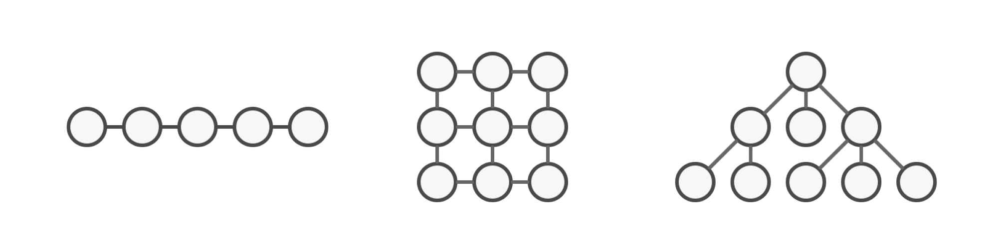
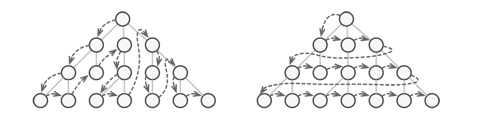
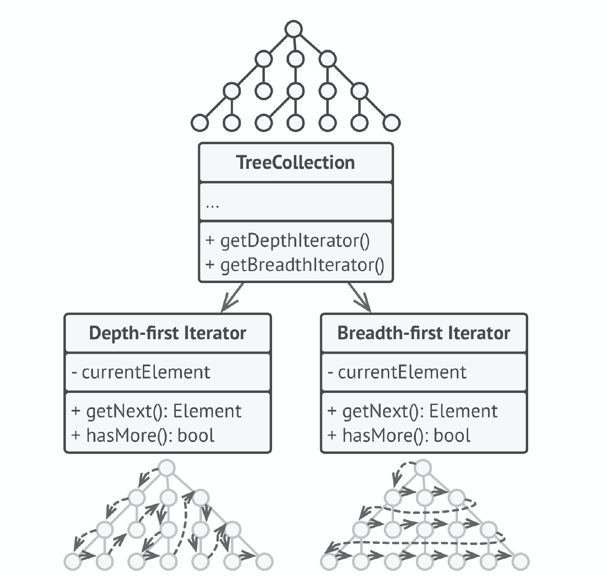
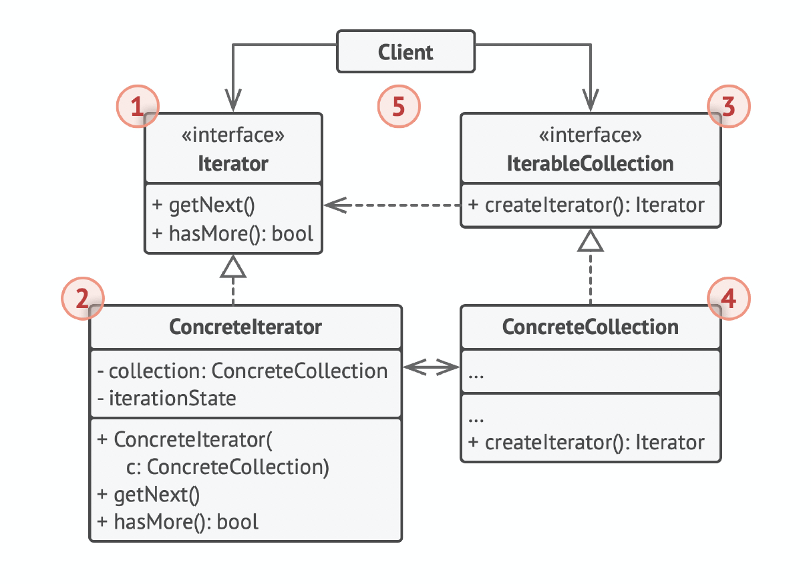

# 迭代器模式（Iterator）

##  定义

迭代器是一种行为设计模式，让你能在不暴露集合底层表现形式（列表、栈和树等）的情况下遍历集合中所有的元素。

## 前言

#### 1. 问题

大部分集合使用简单列表存储元素。但有些集合还会使用栈、树、图和其他复杂的数据结构。



无论集合的构成方式如何，它都必须提供某种访问元素的方式，便于其他代码使用其中的元素。集合应提供一种能够遍历元素的方式，且保证它不会周而复始地访问同一个元素。

如果你的集合基于列表， 那么这项工作听上去仿佛很简单。但如何遍历复杂数据结构（例如树）中的元素呢？例如，今天你需要使用深度优先算法来遍历树结构，明天可能会需要广度优先算法；下周则可能会需要其他方式（比如随机存取树中的元素）。



不断向集合中添加遍历算法会模糊其“高效存储数据”的主要职责。此外，有些算法可能是根据特定应用订制的，将其加入泛型集合类中会显得非常奇怪。

另一方面，使用多种集合的客户端代码可能并不关心存储数据的方式。不过由于集合提供不同的元素访问方式，你的代码将不得不与特定集合类进行耦合。

#### 2. 解决方案

迭代器模式的主要思想是将集合的遍历行为抽取为单独的迭代器对象。



除实现自身算法外， 迭代器还封装了遍历操作的所有细节，例如当前位置和末尾剩余元素的数量。因此，多个迭代器可以在相互独立的情况下同时访问集合。

迭代器通常会提供一个获取集合元素的基本方法。客户端可不断调用该方法直至它不返回任何内容，这意味着迭代器已经遍历了所有元素。

**所有迭代器必须实现相同的接口。**这样一来，只要有合适的迭代器， 客户端代码就能兼容任何类型的集合或遍历算法。如果你需要采用特殊方式来遍历集合，只需创建一个新的迭代器类即可，无需对集合或客户端进行修改。

## 结构



1. 迭代器（Iterator）：接口类，声明了遍历集合所需的操作（获取下一个元素、获取当前位置和重新开始迭代等）。
2. 具体迭代器（Concrete Iterators） ：实现遍历集合的一种特定算法。迭代器对象必须跟踪自身遍历的进度，这使得多个迭代器可以相互独立地遍历同一集合。
3. 集合（Collection）：接口类，声明一个或多个方法来获取与集合兼容的迭代器。请注意，返回方法的类型必须被声明为迭代器接口，因此具体集合可以返回各种不同种类的迭代器。
4. 具体集合（Concrete Collections） ：会在客户端请求迭代器时返回一个特定的具体迭代器类实体。你可能会琢磨，剩下的集合代码在什么地方呢？ 不用担心， 它也会在同一个类中。只是这些细节对于实际模式来说并不重要，所以我们将其省略了而已。
5. 客户端（Client）：通过集合和迭代器的接口与两者进行交互。这样一来客户端无需与具体类进行耦合，允许同一客户端代码使用各种不同的集合和迭代器。客户端通常不会自行创建迭代器，而是会从集合中获取。但在特定情况下，客户端可以直接创建一个迭代器（例如当客户端需要自定义特殊迭代器时）。

## 适用场景

* 当集合背后为复杂的数据结构，且你希望对客户端隐藏其复杂性时（出于使用便利性或安全性的考虑），可以使用迭代器模式。

迭代器封装了与复杂数据结构进行交互的细节，为客户端提供多个访问集合元素的简单方法。这种方式不仅对客户端来说非常方便，而且能避免客户端在直接与集合交互时执行错误或有害的操作，从而起到保护集合的作用。

* 使用该模式可以减少程序中重复的遍历代码。

重要迭代算法的代码往往体积非常庞大。当这些代码被放置在程序业务逻辑中时，它会让原始代码的职责模糊不清，降低其可维护性。因此，将遍历代码移到特定的迭代器中可使程序代码更加精炼和简洁。

* 如果你希望代码能够遍历不同的甚至是无法预知的数据结构，可以使用迭代器模式。

该模式为集合和迭代器提供了一些通用接口。如果你在代码中使用了这些接口，那么将其他实现了这些接口的集合和迭代器传递给它时，它仍将可以正常运行。

## 实现方式

1. 声明迭代器接口。该接口必须提供至少一个方法来获取集合中的下个元素。但为了使用方便，你还可以添加一些其他方法，例如获取前一个元素、记录当前位置和判断迭代是否已结束。
2. 声明集合接口并描述一个获取迭代器的方法。其返回值必须是迭代器接口。如果你计划拥有多组不同的迭代器，则可以声明多个类似的方法。
3. 为希望使用迭代器进行遍历的集合实现具体迭代器类。迭代器对象必须与单个集合实体链接。链接关系通常通过迭代器的构造函数建立。
4. 在你的集合类中实现集合接口。其主要思想是针对特定集合为客户端代码提供创建迭代器的快捷方式。集合对象必须将自身传递给迭代器的构造函数来创建两者之间的链接。
5. 检查客户端代码，使用迭代器替代所有集合遍历代码。每当客户端需要遍历集合元素时都会获取一个新的迭代器。

## 优点

* 单一职责原则。通过将体积庞大的遍历算法代码抽取为独立的类，你可对客户端代码和集合进行整理。
* 开闭原则。你可实现新型的集合和迭代器并将其传递给现有代码，无需修改现有代码。
* 你可以并行遍历同一集合，因为每个迭代器对象都包含其自身的遍历状态。
* 相似的，你可以暂停遍历并在需要时继续。

## 缺点

* 如果你的程序只与简单的集合进行交互，应用该模式可能会矫枉过正。
* 对于某些特殊集合，使用迭代器可能比直接遍历的效率低。

## 与其他模式的关系

* 你可以使用迭代器来遍历组合树。
* 你可以同时使用工厂方法和迭代器来让子类集合返回不同类型的迭代器，并使得迭代器与集合相匹配。
* 你可以同时使用备忘录和迭代器来获取当前迭代器的状态，并且在需要的时候进行回滚。
* 可以同时使用访问者和迭代器来遍历复杂数据结构，并对其中的元素执行所需操作，即使这些元素所属的类完全不同。

## 实例

Iterator.h：

```c++
#ifndef ITERATOR_H_
#define ITERATOR_H_

#include <string>

// 抽象迭代器
class TVIterator{
 public:
    virtual void setChannel(int i) = 0;
    virtual void next() = 0;
    virtual void previous() = 0;
    virtual bool isLast() = 0;
    virtual std::string currentChannel() = 0;
    virtual bool isFirst() = 0;
};

#endif  // ITERATOR_H_
```

ConcreteIterator.h：

```c++
#ifndef CONCRETE_ITERATOR_H_
#define CONCRETE_ITERATOR_H_

#include <string>
#include <vector>
#include "Iterator.h"

// 具体迭代器
class SkyworthIterator : public TVIterator{
 public:
    explicit SkyworthIterator(std::vector<std::string> &tvs) : tvs_(tvs) {}

    void next() override {
        if (current_index_ < tvs_.size()) {
            current_index_++;
        }
    }

    void previous() override {
        if (current_index_ > 0) {
            current_index_--;
        }
    }

    void setChannel(int i) override {
        current_index_ = i;
    }

    std::string currentChannel() override {
        return tvs_[current_index_];
    }

    bool isLast() override {
        return current_index_ == tvs_.size();
    }

    bool isFirst() override {
        return current_index_ == 0;
    }

 private:
    std::vector<std::string> &tvs_;
    int current_index_ = 0;
};

#endif  // CONCRETE_ITERATOR_H_
```

Collection.h：

```c++
#ifndef COLLECTION_H_
#define COLLECTION_H_

#include <memory>
#include "Iterator.h"

// 抽象集合
class Television {
 public:
    virtual std::shared_ptr<TVIterator> createIterator() = 0;
};

#endif  // COLLECTION_H_

```

ConcreteCollection.h：

```c++
#ifndef CONCRETE_COLLECTION_H_
#define CONCRETE_COLLECTION_H_

#include <vector>
#include <string>
#include <memory>
#include "Collection.h"
#include "ConcreteIterator.h"

class SkyworthTelevision : public Television {
 public:
    std::shared_ptr<TVIterator> createIterator() {
        return std::make_shared<SkyworthIterator>(tvs_);
    }

    void addItem(std::string item) {
        tvs_.push_back(item);
    }

 private:
    std::vector<std::string> tvs_;
};

#endif  // CONCRETE_COLLECTION_H_
```

main.cpp：

```c++
#include <iostream>
#include "ConcreteCollection.h"

int main() {
    SkyworthTelevision stv;
    stv.addItem("CCTV-1");
    stv.addItem("CCTV-2");
    stv.addItem("CCTV-3");
    stv.addItem("CCTV-4");
    stv.addItem("CCTV-5");

    auto iter = stv.createIterator();
    while (!iter->isLast()) {
        std::cout << iter->currentChannel() << std::endl;
        iter->next();
    }
    return 0;
}
```

编译运行：

```bash
$g++ main.cpp -std=c++11 -o iterator
$./iterator 
CCTV-1
CCTV-2
CCTV-3
CCTV-4
CCTV-5
```

