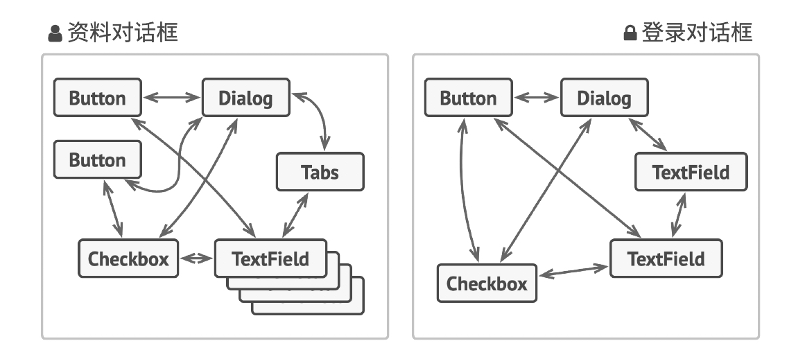
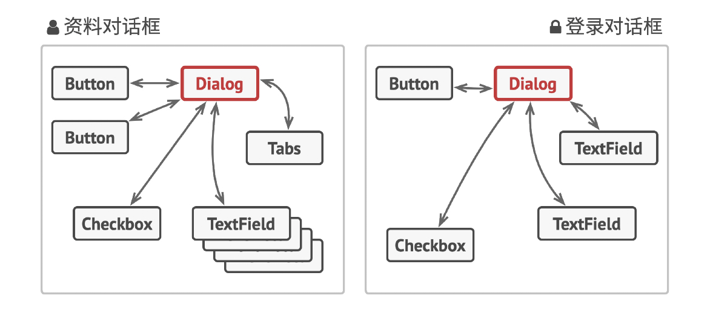
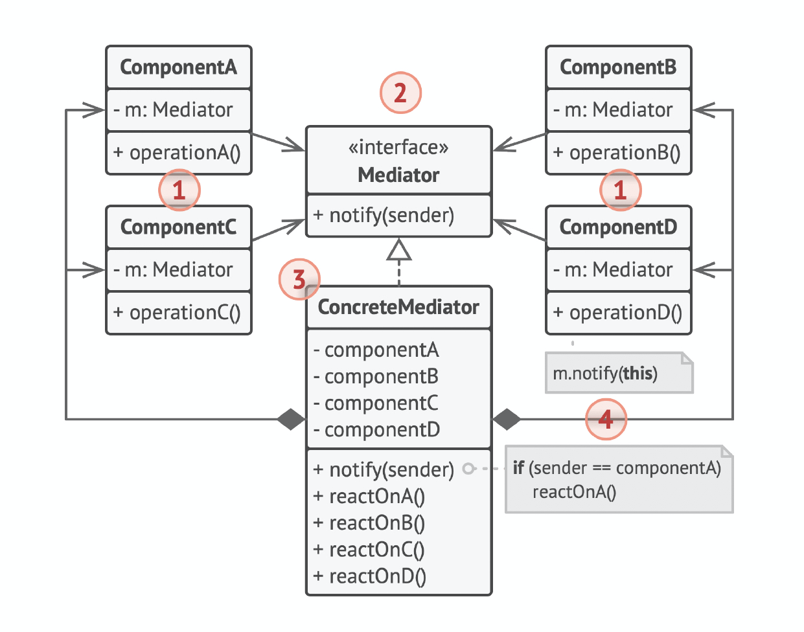

# 中介者模式（Mediator）

## 别名

* 调解人（Intermediary）
* 控制器（Controller）

## 定义

中介者是一种行为设计模式，能让你减少对象之间混乱无序的依赖关系。该模式会限制对象之间的直接交互，迫使它们通过一个中介者对象进行合作。

## 前言

#### 1. 问题

假如你有一个创建和修改客户资料的对话框，它由各种控件组成， 例如文本框（TextField）、复选框（Checkbox） 和按钮（Button）等。



某些表单元素可能会直接进行互动。例如，选中“我有一只狗”复选框后可能会显示一个隐藏文本框用于输入狗狗的名字。另一个例子是提交按钮必须在保存数据前校验所有输入内容。

如果直接在表单元素代码中实现业务逻辑，你将很难在程序其他表单中复用这些元素类。例如，由于复选框类与狗狗的文本框相耦合，所以将无法在其他表单中使用它。你要么使用渲染资料表单时用到的所有类，要么一个都不用。

#### 2. 解决方案

中介者模式建议你停止组件之间的直接交流并使其相互独立。这些组件必须调用特殊的中介者对象，通过中介者对象重定向调用行为，以间接的方式进行合作。最终，组件仅依赖于一个中介者类，无需与多个其他组件相耦合。

在资料编辑表单的例子中， 对话框（Dialog）类本身将作为中介者，其很可能已知自己所有的子元素，因此你甚至无需在该类中引入新的依赖关系。



绝大部分重要的修改都在实际表单元素中进行。让我们想想提交按钮。之前，当用户点击按钮后，它必须对所有表单元素数值进行校验。而现在它的唯一工作是将点击事件通知给对话框。收到通知后，对话框可以自行校验数值或将任务委派给各元素。这样一来， 按钮不再与多个表单元素相关联，而仅依赖于对话框类。

你还可以为所有类型的对话框抽取通用接口，进一步削弱其依赖性。接口中将声明一个所有表单元素都能使用的通知方法， 可用于将元素中发生的事件通知给对话框。这样一来，所有实现了该接口的对话框都能使用这个提交按钮了。

采用这种方式，中介者模式让你能在单个中介者对象中封装多个对象间的复杂关系网。类所拥有的依赖关系越少，就越易于修改、扩展或复用。

## 结构



1. 组件（Component）是各种包含业务逻辑的类。每个组件都有一个指向中介者的引用，该引用被声明为中介者接口类型。组件不知道中介者实际所属的类，因此你可通过将其连接到不同的中介者以使其能在其他程序中复用。
2. 中介者（Mediator）接口声明了与组件交流的方法， 但通常仅包括一个通知方法。组件可将任意上下文（包括自己的对象）作为该方法的参数，只有这样接收组件和发送者类之间才不会耦合。
3. 具体中介者（Concrete Mediator）封装了多种组件间的关系。具体中介者通常会保存所有组件的引用并对其进行管理，甚至有时会对其生命周期进行管理。
4. 组件并不知道其他组件的情况。如果组件内发生了重要事件，它只能通知中介者。中介者收到通知后能轻易地确定发送者，这或许已足以判断接下来需要触发的组件了。对于组件来说，中介者看上去完全就是一个黑箱。发送者不知道最终会由谁来处理自己的请求，接收者也不知道最初是谁发出了请求。

## 适用场景

* 当一些对象和其他对象紧密耦合以致难以对其进行修改时，可使用中介者模式。

该模式让你将对象间的所有关系抽取成为一个单独的类，以使对于特定组件的修改工作独立于其他组件。

* 当组件因过于依赖其他组件而无法在不同应用中复用时，可使用中介者模式。

应用中介者模式后，每个组件不再知晓其他组件的情况。尽管这些组件无法直接交流，但它们仍可通过中介者对象进行间接交流。如果你希望在不同应用中复用一个组件，则需要为其提供一个新的中介者类。

* 如果为了能在不同情景下复用一些基本行为，导致你需要被迫创建大量组件子类时，可使用中介者模式。

由于所有组件间关系都被包含在中介者中，因此你无需修改组件就能方便地新建中介者类以定义新的组件合作方式。

## 实现方式

1. 找到一组当前紧密耦合，且提供其独立性能带来更大好处的类（例如更易于维护或更方便复用）。
2. 声明中介者接口并描述中介者和各种组件之间所需的交流接口。在绝大多数情况下，一个接收组件通知的方法就足够了。如果你希望在不同情景下复用组件类，那么该接口将非常重要。只要组件使用通用接口与其中介者合作，你就能将该组件与不同实现中的中介者进行连接。
3. 实现具体中介者类。该类可从自行保存其下所有组件的引用中受益。
4. 你可以更进一步，让中介者负责组件对象的创建和销毁。此后，中介者可能会与工厂或外观类似。
5. 组件必须保存对于中介者对象的引用。该连接通常在组件的构造函数中建立，该函数会将中介者对象作为参数传递。
6. 修改组件代码，使其可调用中介者的通知方法，而非其他组件的方法。然后将调用其他组件的代码抽取到中介者类中，并在中介者接收到该组件通知时执行这些代码。

## 优点

* 单一职责原则。你可以将多个组件间的交流抽取到同一位置，使其更易于理解和维护。
* 开闭原则。你无需修改实际组件就能增加新的中介者。
* 你可以减轻应用中多个组件间的耦合情况。
* 你可以更方便地复用各个组件。

## 缺点

一段时间后，中介者可能会演化成为上帝对象。

## 与其他模式的关系

* 责任链、命令、中介者和观察者用于处理请求发送者和接收者之间的不同连接方式：
  * 责任链按照顺序将请求动态传递给一系列的潜在接收者，直至其中一名接收者对请求进行处理。
  * 命令在发送者和请求者之间建立单向连接。
  * 中介者清除了发送者和请求者之间的直接连接，强制它们通过一个中介对象进行间接沟通。
  * 观察者允许接收者动态地订阅或取消接收请求。
* 外观和中介者的职责类似：它们都尝试在大量紧密耦合的类中组织起合作。
  * 外观为子系统中的所有对象定义了一个简单接口，但是它不提供任何新功能。子系统本身不会意识到外观的存在。子系统中的对象可以直接进行交流。
  * 中介者将系统中组件的沟通行为中心化。各组件只知道中介者对象，无法直接相互交流。
* 中介者和观察者之间的区别往往很难记住。在大部分情况下，你可以使用其中一种模式，而有时可以同时使用。让我们来看看如何做到这一点。
  * 中介者的主要目标是消除一系列系统组件之间的相互依赖。这些组件将依赖于同一个中介者对象。观察者的目标是在对象之间建立动态的单向连接，使得部分对象可作为其他对象的附属发挥作用。
  * 有一种流行的中介者模式实现方式依赖于观察者。中介者对象担当发布者的角色，其他组件则作为订阅者，可以订阅中介者的事件或取消订阅。当中介者以这种方式实现时，它可能看上去与观察者非常相似。
  * 当你感到疑惑时，记住可以采用其他方式来实现中介者。例如，你可永久性地将所有组件链接到同一个中介者对象。这种实现方式和观察者并不相同，但这仍是一种中介者模式。
  * 假设有一个程序，其所有的组件都变成了发布者，它们之间可以相互建立动态连接。这样程序中就没有中心化的中介者对象，而只有一些分布式的观察者。

## 实例

Component.h：

```c++
#ifndef COMPONENT_H_
#define COMPONENT_H_

#include "Mediator.h"
#include <cstdio>
#include <string>

enum PERSON_TYPE {
    kUnknown,
    kLandlord,
    kTenant,
};

// 组件基类
class Colleague {
 public:
    void set_mediator(Mediator *m) {
        mediator_ = m;
    }
    Mediator* get_mediator() {
        return mediator_;
    }
    void set_personType(PERSON_TYPE pt) {
        person_type_ = pt;
    }
    PERSON_TYPE get_person_type() {
        return person_type_;
    }
    virtual void ask() = 0;
    virtual void answer() = 0;
 private:
    Mediator* mediator_;
    PERSON_TYPE person_type_;
};

// 具体组件1: 房东
class Landlord : public Colleague {
 public:
    Landlord() {
        name_ = "unknown";
        price_ = -1;
        address_ = "unknown";
        phone_number_ = "unknown";
        set_personType(kUnknown);
    }

    Landlord(std::string name, int price, std::string address, std::string phone_number) {
        name_ = name;
        price_ = price;
        address_ = address;
        phone_number_ = phone_number;
        set_personType(kLandlord);
    }

    void answer() override {
        printf("房东姓名:%s 房租:%d 地址:%s 电话:%s\n", name_.c_str(), price_, address_.c_str(), phone_number_.c_str());
    }

    void ask() override {
        printf("房东%s查看租客信息: \n", name_.c_str());
        this->get_mediator()->operation(this);
    }

 private:
    std::string name_;
    int price_;
    std::string address_;
    std::string phone_number_;
};

// 具体组件2: 租客
class Tenant : public Colleague {
 public:
    Tenant() {
        name_ = "unknown";
    }
    explicit Tenant(std::string name) {
        name_ = name;
        set_personType(kTenant);
    }
    void ask() {
        printf("租客%s询问房东信息:\n", name_.c_str());
        this->get_mediator()->operation(this);
    }
    void answer() {
        printf("租客姓名: %s\n", name_.c_str());
    }

 private:
    std::string name_;
};

#endif  // COMPONENT_H_
```

ConcreteMediator.h：

```c++
#ifndef CONCRETE_MEDIATOR_H_
#define CONCRETE_MEDIATOR_H_

#include <vector>
#include <string>
#include "Component.h"
#include "Mediator.h"

// 具体中介类: 房产中介
class Agency : public Mediator {
 public:
    void registerMethod(Colleague* person) override {
        switch (person->get_person_type()) {
            case kLandlord:
                landlord_list_.push_back(reinterpret_cast<Landlord*>(person));
                break;
            case kTenant:
                tenant_list_.push_back(reinterpret_cast<Tenant*>(person));
                break;
            default:
                printf("wrong person\n");
        }
    }

    void operation(Colleague* person) {
        switch (person->get_person_type()) {
            case kLandlord:
                for (int i = 0; i < tenant_list_.size(); i++) {
                    tenant_list_[i]->answer();
                }
                break;
            case kTenant:
                for (int i = 0; i < landlord_list_.size(); i++) {
                    landlord_list_[i]->answer();
                }
                break;
            default:
                break;
        }
    }

 private:
    std::vector<Landlord*> landlord_list_;
    std::vector<Tenant*> tenant_list_;
};

#endif  // CONCRETE_MEDIATOR_H_

```

Mediator.h：

```c++
#ifndef MEDIATOR_H_
#define MEDIATOR_H_

#include <string>

class Colleague;

// 抽象中介者
class Mediator {
 public:
    // 声明抽象方法
    virtual void registerMethod(Colleague*) = 0;
    // 声明抽象方法
    virtual void operation(Colleague*) = 0;
};

#endif  // MEDIATOR_H_

```

main.cpp：

```c++
#include <iostream>
#include "ConcreteMediator.h"
#include "Component.h"

int main() {
    // 房产中介
    Agency *mediator = new Agency();

    // 三位房东
    Landlord *l1 = new Landlord("张三", 1820, "天津", "1333");
    Landlord *l2 = new Landlord("李四", 2311, "北京", "1555");
    Landlord *l3 = new Landlord("王五", 3422, "河北", "1777");
    l1->set_mediator(mediator);
    l2->set_mediator(mediator);
    l3->set_mediator(mediator);
    mediator->registerMethod(l1);
    mediator->registerMethod(l2);
    mediator->registerMethod(l3);

    // 两位租客
    Tenant *t1 = new Tenant("Zhang");
    Tenant *t2 = new Tenant("Yang");
    t1->set_mediator(mediator);
    t2->set_mediator(mediator);
    mediator->registerMethod(t1);
    mediator->registerMethod(t2);

    // 业务逻辑
    t1->ask();
    std::cout << std::endl;
    l1->ask();

    delete mediator;
    delete l1;
    delete l2;
    delete l3;
    delete t1;
    delete t2;
}
```

编译运行：

```bash
$g++ -g main.cpp -o mediator -std=c++11
$./mediator 
租客Zhang询问房东信息:
房东姓名:张三 房租:1820 地址:天津 电话:1333
房东姓名:李四 房租:2311 地址:北京 电话:1555
房东姓名:王五 房租:3422 地址:河北 电话:1777

房东张三查看租客信息: 
租客姓名: Zhang
租客姓名: Yang
```


