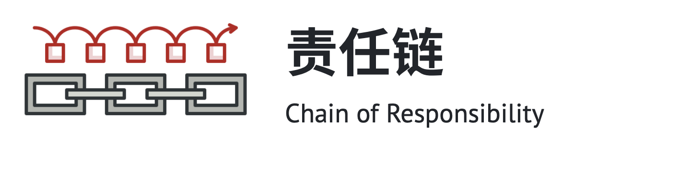
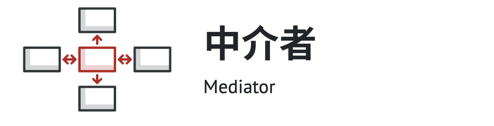
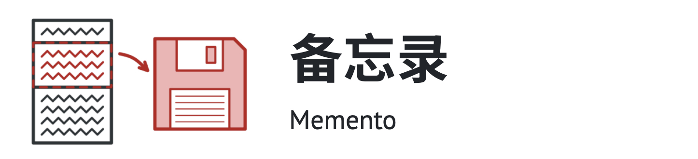
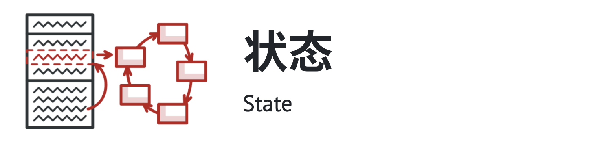
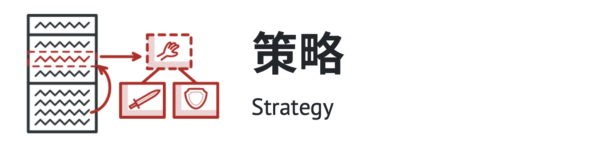
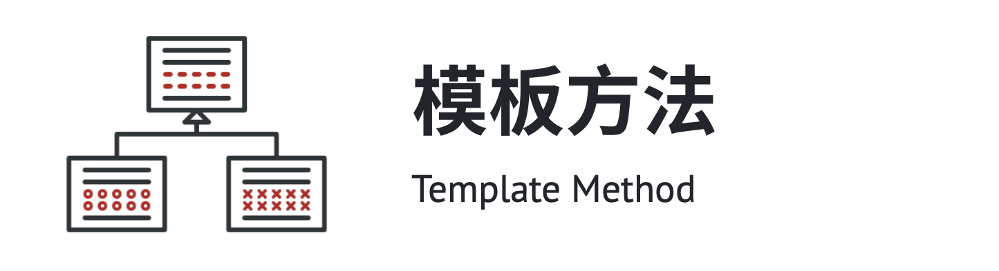

# 行为型模式

## 简介

行为型模式（Behavioral Pattern）是对在不同的对象之间划分责任和算法的抽象化。

行为型模式不仅仅关注类和对象的结构，而且重点关注它们之间的相互作用。

通过行为型模式，可以更加清晰地划分类与对象的职责，并研究系统在运行时实例对象 之间的交互。在系统运行时，对象并不是孤立的，它们可以通过相互通信与协作完成某些复杂功能，一个对象在运行时也将影响到其他对象的运行。

行为型模式分为类行为型模式和对象行为型模式两种：

- 类行为型模式：类的行为型模式使用继承关系在几个类之间分配行为，类行为型模式主要通过多态等方式来分配父类与子类的职责。
- 对象行为型模式：对象的行为型模式则使用对象的聚合关联关系来分配行为，对象行为型模式主要是通过对象关联等方式来分配两个或多个类的职责。

根据“合成复用原则”，系统中要尽量使用关联关系来取代继承关系，因此大部分行为型设计模式都属于对象行为型设计模式。

## 包含模式

#### 1. 责任链模式

允许你讲请求沿着处理者链进行发送。收到请求后，每个处理者可对请求进行处理，或将其传递给链上的下个处理者。

#### 2. 命令模式

它可将请求转换为一个包含与请求相关的所有信息的独立对象。该转换让你能根据不同的请求将方法参数化、延迟请求执行或将其放入队列中，且能实现可撤销操作。

#### 3. 迭代器模式

让你能在不暴露集合底层表现形式（列表、栈和树等）的情况下遍历集合中所有的元素。

#### 4. 中介者模式

能让你减少对象之间混乱无序的依赖关系。该模式会限制对象之间的直接交互，迫使它们通过一个中介者对象进行合作。

##### 5. 备忘录模式

允许在不暴露对象实现细节的情况下保存和恢复对象之前的状态。

#### 6. 观察者模式

允许你定义一种订阅机制，可在对象事件发生时通知多个“观察”该对象的其他对象。

#### 7. 状态模式

让你能在一个对象的内部状态变化时改变其行为，使其看上去就像改变了自身所属的类一样。

#### 8. 策略模式

能让你定义一系列算法，并将每种算法分别放入独立的类中，以使算法的对象能够相互替换。

#### 9. 模板方法

在超类中定义一个算法的框架，允许子类在不修改结构的情况下重写算法的特定步骤。

#### 10. 访问者模式

将算法与其所作用的对象隔离开来。

