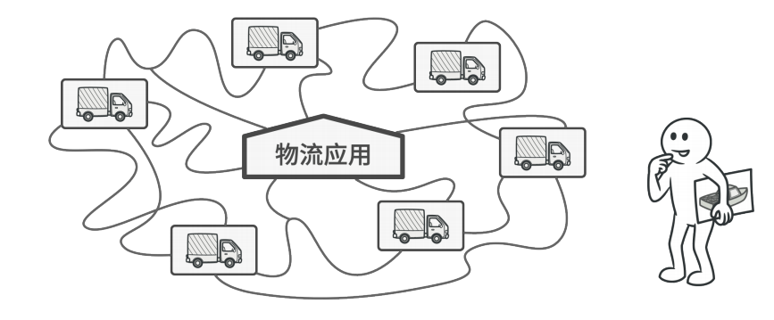
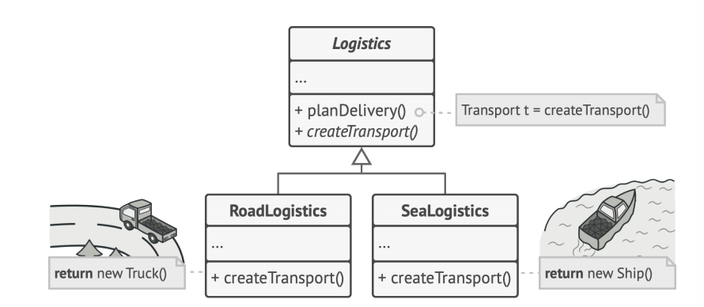
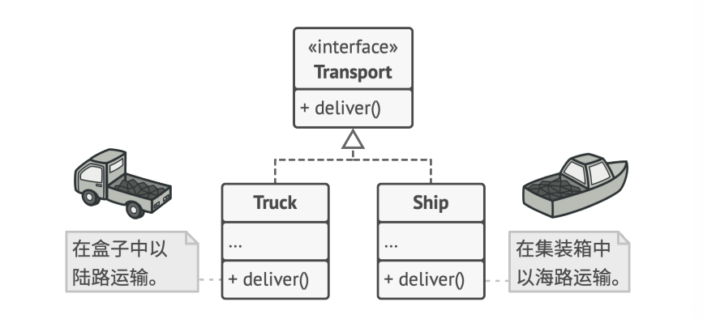
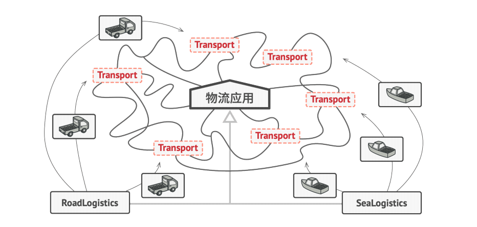
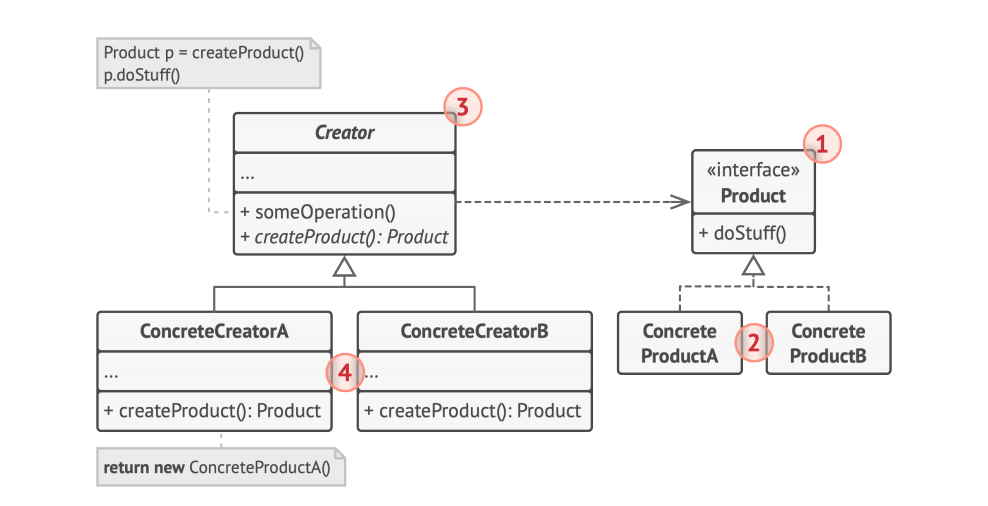

# 工厂方法模式（Factory Method）

## 别名

虚拟构造函数（Virtual Constructor）。

## 定义

**工厂方法**是一种创建型设计模式，其在父类中提供一个创建对象的方法，允许子类决定实例化对象的类型。

## 前言

#### 1. 问题

假设你正在开发一款物流管理应用。最初版本只能处理卡车运输，因此大部分代码都在位于名为“卡车”的类中。

一段时间后，这款应用变得极受欢迎。你每天都能收到十几次来自海运公司的请求，希望应用能够支持海上物流功能。



这可是个好消息。但是代码问题该如何处理呢？目前，大部分代码都与 卡车 类相关。在程序中添加 轮船 类需要修改全部代码。更糟糕的是，如果你以后需要在程序中支持另外一种运输方式，很可能需要再次对这些代码进行大幅修改。

最后，你将不得不编写繁复的代码，根据不同的运输对象类，在应用中进行不同的处理。 

#### 2. 解决方案

工厂方法模式建议使用特殊的工厂方法代替对于对象构造函数的直接调用（即使用 new 运算符）。不用担心，对象仍将通过 new 运算符创建，只是该运算符改在工厂方法中调用罢了。工厂方法返回的对象通常被称作“产品”。



乍看之下，这种更改可能毫无意义：我们只是改变了程序中调用构造函数的位置而已。但是，仔细想一下，现在你可以在子类中重写工厂方法，从而改变其创建产品的类型。

但有一点需要注意:仅当这些产品具有共同的基类或者接口时，子类才能返回不同类型的产品，同时基类中的工厂方法还应将其返回类型声明为这一共有接口。 



举例来说， 卡车（Truck）和 轮船（Ship）类都必须实现运输（Transport）接口， 该接口声明了一个交付（deliver）的方法。 每个类都将以不同的方式实现该方法：卡车走陆路交付货物，轮船走海路交付货物。

陆路运输（RoadLogistics）类中的工厂方法返回卡车对象，而海路运输（SeaLogistics）类则返回轮船对象。



调用工厂方法的代码（通常被称为客户端代码）无需了解不同子类返回实际对象之间的差别。客户端将所有产品视为抽象的“运输”。 客户端知道所有运输对象都提供“交付”方法，但是并不关心其具体实现方式。

## 结构



1. **产品**（Product）将会对接口进行声明。对于所有由创建者及其子类构建的对象，这些接口都是通用的。

2. **具体产品**（Concrete Products）是产品接口的不同实现。

3. **创建者**（Creator）类声明返回产品对象的工厂方法。该方法的返回对象类型必须与产品接口相匹配。 你可以将工厂方法声明为抽象方法，强制要求每个子类以不同方式实现该方法。或者，你也可以在基础工厂方法中返回默认产品类型。注意，尽管它的名字是创建者，但他最主要的职责并**不是**创建产品。一般来说，创建者类包含一些与产品相关的核心业务逻辑。工厂方法将这些逻辑处理从具体产品类中分离出来。打个比方，大型软件开发公司拥有程序员培训部门。但是，这些公司的主要工作还是编写代码，而非生产程序员。

4. **具体创建者**（Concrete Creators） 将会重写基础工厂方法，使其返回不同类型的产品。注意，并不一定每次调用工厂方法都会**创建**新的实例。工厂

   方法也可以返回缓存、对象池或其他来源的已有对象。

## 适用场景

* 当你在编写代码的过程中，如果无法预知对象确切类别及其依赖关系时，可使用工厂方法。

工厂方法将创建产品的代码与实际使用产品的代码分离，从而能在不影响其他代码的情况下扩展产品创建部分代码。例如，如果需要向应用中添加一种新产品，你只需要开发新的创建者子类，然后重写其工厂方法即可。

* 如果你希望用户能扩展你软件库或框架的内部组件，可使用工厂方法。

继承可能是扩展软件库或框架默认行为的最简单方法。但是当你使用子类替代标准组件时，框架如何辨识出该子类？解决方案是将各框架中构造组件的代码集中到单个工厂方法中，并在继承该组件之外允许任何人对该方法进行重写。

* 如果你希望复用现有对象来节省系统资源，而不是每次都重新创建对象，可使用工厂方法。

在处理大型资源密集型对象（比如数据库连接、文件系统和网络资源）时，你会经常碰到这种资源需求。

## 实现方式

1. 让所有产品都遵循同一接口。该接口必须声明对所有产品都有意义的方法。
2. 在创建类中添加一个空的工厂方法。该方法的返回类型必须遵循通用的产品接口。
3. 在创建者代码中找到对于产品构造函数的所有引用。将它们依次替换为对于工厂方法的调用，同时将创建产品的代码移入工厂方法。你可能需要在工厂方法中添加临时参数来控制返回的产品类型。工厂方法的代码看上去可能非常糟糕。其中可能会有复杂的switch 分支 运算符，用于选择各种需要实例化的产品类。但是不要担心，我们很快就会修复这个问题。 
4. 现在，为工厂方法中的每种产品编写一个创建者子类，然后在子类中重写工厂方法，并将基本方法中的相关创建代码移动到工厂方法中。
5. 如果应用中的产品类型太多，那么为每个产品创建子类并无太大必要，这时你也可以在子类中复用基类中的控制参数。
6. 如果代码经过上述移动后，基础工厂方法中已经没有任何代码，你可以将其转变为抽象类。如果基础工厂方法中还有其他语句，你可以将其设置为该方法的默认行为。

## 优点

* 你可以避免创建者和具体产品之间的紧密耦合。
* 单一职责原则。你可以将产品创建代码放在程序的单一位置，从而使得代码更容易维护。 
* 开闭原则。无需更改现有客户端代码，你就可以在程序中引入新的产品类型。

## 缺点

应用工厂方法模式需要引入许多新的子类，代码可能会因此变得更复杂。最好的情况是将该模式引入创建者类的现有层次结构中。

## 与其他模式的关系

* 在许多设计工作的初期都会使用**工厂方法**（较为简单，而且可以更方便地通过子类进行定制），随后演化为使用**抽象工厂**、**原型**或**生成器**（更灵活但更加复杂）。
* **抽象工厂**模式通常基于一组**工厂方法**，但你也可以使用**原型**模式来生成这些类的方法。 
* 你可以同时使用**工厂方法**和**迭代器**来让子类集合返回不同类型的迭代器，并使得迭代器与集合相匹配。
* **原型**并不基于继承，因此没有继承的缺点。另一方面，原型需要对被复制对象进行复杂的初始化。 **工厂方法**基于继承，但是它不需要初始化步骤。 
* **工厂方法**是**模板方法**的一种特殊形式。同时，工厂方法可以作为一个大型模板方法中的一个步骤。 

## 实例

Creator.h：

```c++
#ifndef  CREATOR_H_
#define  CREATOR_H_

#include <memory>
#include "Product.h"

// 抽象工厂类 生产电影
class Factory {
 public:
    virtual std::shared_ptr<Movie> get_movie() = 0;
};

#endif  // CREATOR_H_
```

ConcreteCreator.h：

```c++
#ifndef CONCRETE_CREATOR_H_
#define CONCRETE_CREATOR_H_

#include <memory>
#include "Creator.h"
#include "ConcreteProduct.h"

// 具体工厂类 中国生产者
class ChineseProducer : public Factory {
 public:
    std::shared_ptr<Movie> get_movie() override {
        return std::make_shared<ChineseMovie>();
    }
};

// 具体工厂类 日本生产者
class JapaneseProducer : public Factory {
 public:
    std::shared_ptr<Movie> get_movie() override {
        return std::make_shared<ChineseMovie>();
    }
};

// 具体工厂类 美国生产者
class AmericanProducer : public Factory {
 public:
    std::shared_ptr<Movie> get_movie() override {
        return std::make_shared<ChineseMovie>();
    }
};

#endif  // CONCRETE_CREATOR_H_
```

Product.h：

```c++
#ifndef  PRODUCT_H_
#define  PRODUCT_H_

#include <string>

// 抽象产品类 电影
class Movie {
 public:
    virtual std::string get_a_movie() = 0;
};

#endif  // PRODUCT_H_
```

ConcreteProduct.h：

```c++
#ifndef  CONCRETE_PRODUCT_H_
#define  CONCRETE_PRODUCT_H_

#include <iostream>
#include <string>
#include "Product.h"

// 具体产品类 电影::国产电影
class ChineseMovie : public Movie {
 public:
    std::string get_a_movie() override {
        return "《让子弹飞》";
    }
};

// 具体产品类 电影::日本电影
class JapaneseMovie : public Movie {
 public:
    std::string get_a_movie() override {
        return "《千与千寻》";
    }
};

// 具体产品类 电影::美国电影
class AmericanMovie : public Movie {
 public:
    std::string get_a_movie() override {
        return "《钢铁侠》";
    }
};

#endif  // CONCRETE_PRODUCT_H_
```

main.cpp：

```c++
#include "ConcreteCreator.h"

int main() {
    std::shared_ptr<Factory> factory;
    std::shared_ptr<Movie> product;

    // 这里假设从配置中读到的是Chinese(运行时决定的)
    std::string conf = "China";

    // 程序根据当前配置或环境选择创建者的类型
    if (conf == "China") {
        factory = std::make_shared<ChineseProducer>();
    } else if (conf == "Japan") {
        factory = std::make_shared<JapaneseProducer>();
    } else if (conf == "America") {
        factory = std::make_shared<AmericanProducer>();
    } else {
        std::cout << "error conf" << std::endl;
    }

    product = factory->get_movie();
    std::cout << "获取一部电影: " << product->get_a_movie() << std::endl;
}
```

编译运行：

```bash
$g++ -g main.cpp -o factorymethod -std=c++11
$./factorymethod 
获取一部电影: 《让子弹飞》
```

## Reference

[1] https://blog.csdn.net/sinat_21107433/article/details/102616501

[2] https://design-patterns.readthedocs.io/zh_CN/latest/creational_patterns/factory_method.html

[3] https://blog.csdn.net/lxq1997/article/details/88135496