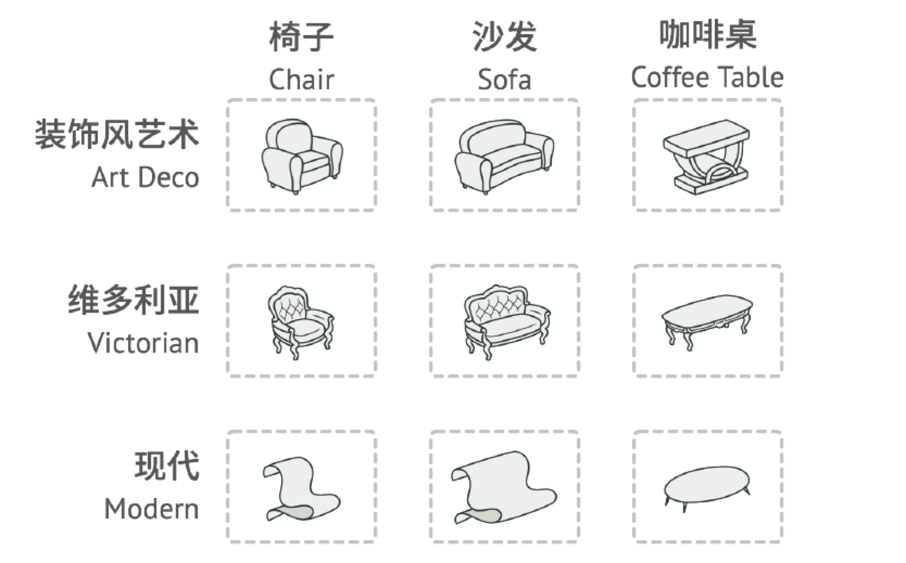
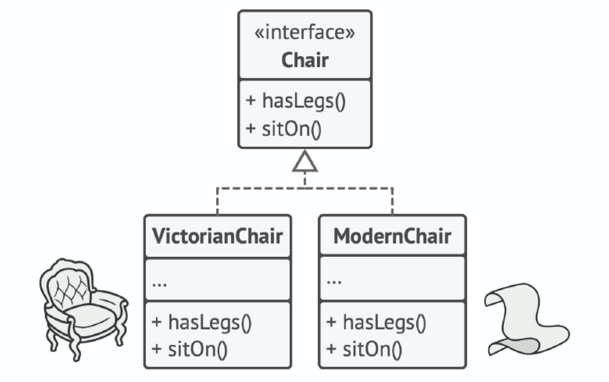
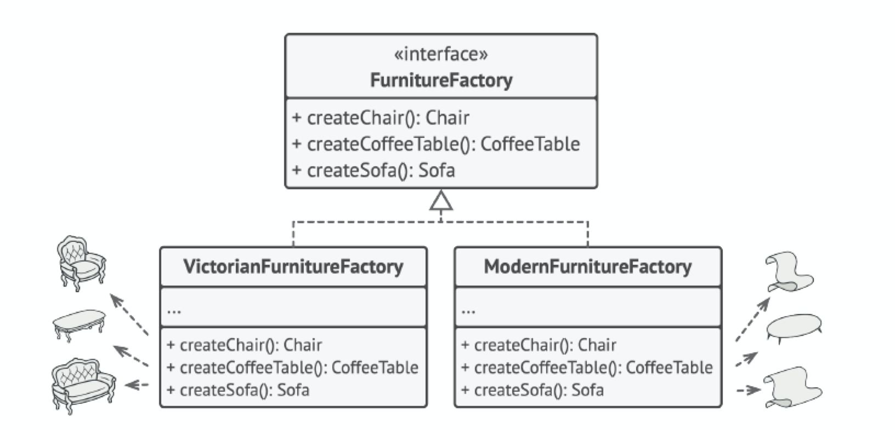
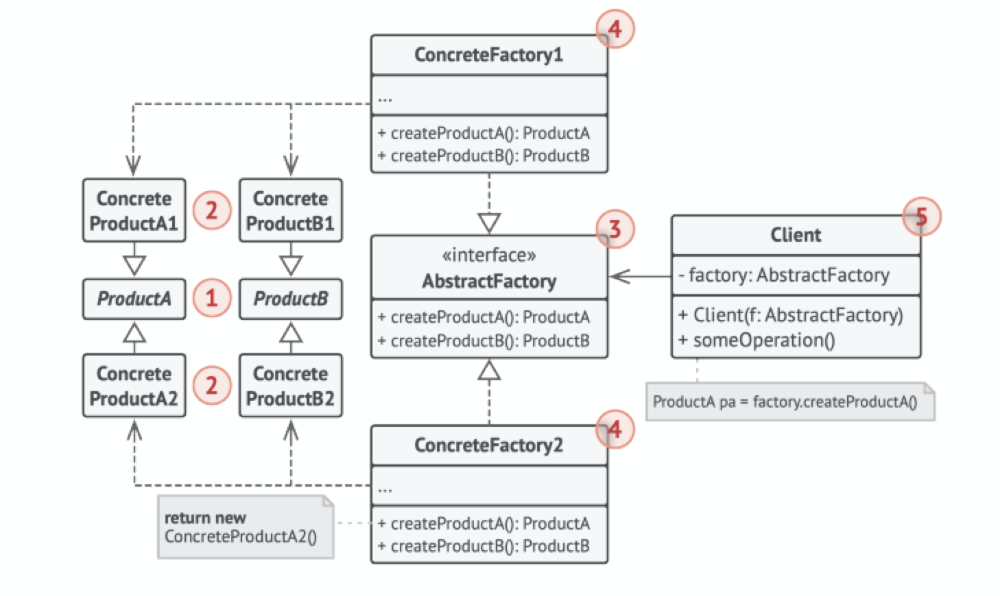

# 抽象工厂模式（Abstract Factory）

## 定义

抽象工厂是一种创建型设计模式，它能创建一系列相关的对象，而无需指定其具体类。

## 前言

#### 1. 问题

假设你正在开发一款家具商店模拟器。你的代码中包括一些类，用于表示：

* 一系列相关产品，例如椅子（Chair）、沙发（Sofa）和咖啡桌（CoffeeTable）
* 系列产品的不同变体，例如你可以使用现代（Modern）、维多利亚（Victorian）和装饰风艺术（ArtDeco）等风格生成这些产品



你需要设法单独生成每件家具对象，这样才能确保其风格一致。如果顾客收到的家具风格不一样，他们可不会开心。

此外， 你也不希望在添加新产品或新风格时修改已有代码。家具供应商对于产品目录的更新非常频繁，你不会想在每次更新时都去修改核心代码的。

#### 2. 解决方案

首先，抽象工厂模式建议为系列中的每件产品明确声明接口（例如椅子、沙发或咖啡桌）。然后，确保所有产品变体都继承这些接口。例如，所有风格的椅子都实现椅子接口；所有风格的咖啡桌都实现咖啡桌接口，以此类推。



接下来， 我们需要声明抽象工厂——包含系列中所有产品构造方法的接口。例如创建椅子（createChair）、创建沙发（createSofa）和 创建咖啡桌（createCoffeeTable）。这些方法必须返回抽象产品类型，即我们之前抽取的那些接口： 椅子，沙发和咖啡桌等等。



那么该如何处理产品变体呢？ 对于系列产品的每个变体， 我们都将基于抽象工厂接口创建不同的工厂类。每个工厂类都只能返回特定类别的产品，例如， 现代家具工厂（ModernFurnitureFactory）只能创建现代椅（ModernChair）、现代沙发（ModernSofa）和现代咖啡桌（ModernCoffeeTable）对象。

客户端代码可以通过相应的抽象接口调用工厂和产品类。你无需修改实际客户端代码，就能更改传递给客户端的工厂类，也能更改客户端代码接收的产品变体。

假设客户端想要工厂创建一把椅子。客户端无需了解工厂类，也不用管工厂类创建出的椅子类型。无论是现代风格，还是维多利亚风格的椅子，对于客户端来说没有分别，它只需调用抽象椅子接口就可以了。这样一来，客户端只需知道椅子以某种方式实现了坐下（sitOn）方法就足够了。此外，无论工厂返回的是何种椅子变体，它都会和由同一工厂对象创建的沙发或咖啡桌风格一致。

最后一点说明：如果客户端仅接触抽象接口，那么谁来创建实际的工厂对象呢？一般情况下，应用程序会在初始化阶段创建具体工厂对象。而在此之前，应用程序必须根据配置文件或环境设定选择工厂类别。

## 结构



1. 抽象产品（Abstract Product）为构成系列产品的一组不同但相关的产品声明接口。
2. 具体产品（Concrete Product）是抽象产品的多种不同类型实现。所有变体（维多利亚/现代）都必须实现相应的抽象产品（椅子/沙发）。
3. 抽象工厂（Abstract Factory）接口声明了一组创建各种抽象产品的方法。
4. 具体工厂（Concrete Factory）实现抽象工厂的构建方法。每个具体工厂都对应特定产品变体，且仅创建此种产品变体。
5. 尽管具体工厂会对具体产品进行初始化，其构建方法签名必须返回相应的抽象产品。这样，使用工厂类的客户端代码就不会与工厂创建的特定产品变体耦合。客户端（Client）只需通过抽象接口调用工厂和产品对象，就能与任何具体工厂/产品变体交互。

## 适用场景

* 如果代码需要与多个不同系列的相关产品交互，但是由于无法提前获取相关信息，或者出于对未来扩展性的考虑，你不希望代码基于产品的具体类进行构建，在这种情况下，你可以使用抽象工厂。

抽象工厂为你提供了一个接口，可用于创建每个系列产品的对象。只要代码通过该接口创建对象，那么你就不会生成与应用程序已生成的产品类型不一致的产品。

* 如果你有一个基于一组抽象方法的类，且其主要功能因此变得不明确，那么在这种情况下可以考虑使用抽象工厂模式。

在设计良好的程序中，每个类仅负责一件事。如果一个类与多种类型产品交互，就可以考虑将工厂方法抽取到独立的工厂类或具备完整功能的抽象工厂类中。

## 实现方式

1. 以不同的产品类型与产品变体为维度绘制矩阵。
2. 为所有产品声明抽象产品接口。然后让所有具体产品类实现这些接口。
3. 声明抽象工厂接口，并且在接口中为所有抽象产品提供一组构建方法。
4. 为每种产品变体实现一个具体工厂类。
5. 在应用程序中开发初始化代码。该代码根据应用程序配置或当前环境，对特定具体工厂类进行初始化。然后将该工厂对象传递给所有需要创建产品的类。
6. 找出代码中所有对产品构造函数的直接调用，将其替换为对工厂对象中相应构建方法的调用。

## 优点

* 你可以确保同一工厂生成的产品相互匹配。
* 你可以避免客户端和具体产品代码的耦合。
* 单一职责原则。你可以将产品生成代码抽取到同一位置，使得代码易于维护。
* 开闭原则。向应用程序中引入新产品变体时，你无需修改客户端代码。

## 缺点

由于采用该模式需要向应用中引入众多接口和类，代码可能会比之前更加复杂。

## 与其他模式的关系

* 在许多设计工作的初期都会使用工厂方法（较为简单，而且可以更方便地通过子类进行定制）， 随后演化为使用抽象工厂、原型或生成器（更灵活但更加复杂）。
* 生成器重点关注如何分步生成复杂对象。抽象工厂专门用于生产一系列相关对象。抽象工厂会马上返回产品，生成器则允许你在获取产品前执行一些额外构造步骤。

* 抽象工厂模式通常基于一组工厂方法，但你也可以使用原型模式来生成这些类的方法。
* 当只需对客户端代码隐藏子系统创建对象的方式时，你可以使用抽象工厂来代替外观。
* 你可以将抽象工厂和桥接搭配使用。如果由桥接定义的抽象只能与特定实现合作，这一模式搭配就非常有用。在这种情况下，抽象工厂可以对这些关系进行封装，并且对客户端代码隐藏其复杂性。
* 抽象工厂、生成器和原型都可以用单例来实现。

## 实例

AbstractFactory.h：

```c++
#ifndef  ABSTRACT_FACTORY_H_
#define  ABSTRACT_FACTORY_H_

#include <memory>
#include "AbstractProduct.h"

// 抽象工厂类 生产电影和书籍类等
class Factory {
 public:
    virtual std::shared_ptr<Movie> productMovie() = 0;
    virtual std::shared_ptr<Book> productBook() = 0;
};

#endif  // ABSTRACT_FACTORY_H_
```

ConcreteFactory.h：

```c++
#ifndef CONCRETE_FACTORY_H_
#define CONCRETE_FACTORY_H_

#include <memory>
#include "AbstractFactory.h"
#include "ConcreteProduct.h"

// 具体工厂类 中国生产者
class ChineseProducer : public Factory {
 public:
    std::shared_ptr<Movie> productMovie() override {
        return std::make_shared<ChineseMovie>();
    }

    std::shared_ptr<Book> productBook() override {
        return std::make_shared<ChineseBook>();
    }
};

// 具体工厂类 日本生产者
class JapaneseProducer : public Factory {
 public:
    std::shared_ptr<Movie> productMovie() override {
        return std::make_shared<JapaneseMovie>();
    }

    std::shared_ptr<Book> productBook() override {
        return std::make_shared<JapaneseBook>();
    }
};

#endif  // CONCRETE_FACTORY_H_
```

AbstractProduct.h：

```c++
#ifndef  ABSTRACT_PRODUCT_H_
#define  ABSTRACT_PRODUCT_H_

#include <string>

// 抽象产品类 电影
class Movie {
 public:
    virtual std::string showMovieName() = 0;
};

// 抽象产品类 书籍
class Book {
 public:
    virtual std::string showBookName() = 0;
};

#endif  // ABSTRACT_PRODUCT_H_
```

ConcreteProduct.h：

```c++
#ifndef  CONCRETE_PRODUCT_H_
#define  CONCRETE_PRODUCT_H_

#include <iostream>
#include <string>
#include "AbstractProduct.h"

// 具体产品类 电影::国产电影
class ChineseMovie : public Movie {
    std::string showMovieName() override {
        return "《让子弹飞》";
    }
};

// 具体产品类 电影::日本电影
class JapaneseMovie : public Movie {
    std::string showMovieName() override {
        return "《千与千寻》";
    }
};

// 具体产品类 书籍::国产书籍
class ChineseBook : public Book {
    std::string showBookName() override {
        return "《三国演义》";
    }
};

// 具体产品类 书籍::日本书籍
class JapaneseBook : public Book {
    std::string showBookName() override {
        return "《白夜行》";
    }
};

#endif  // CONCRETE_PRODUCT_H_
```

main.cpp：

```c++
#include <iostream>
#include "AbstractFactory.h"
#include "ConcreteFactory.h"


int main() {
    std::shared_ptr<Factory> factory;

    // 这里假设从配置中读到的是Chinese(运行时决定的)
    std::string conf = "China";

    // 程序根据当前配置或环境选择创建者的类型
    if (conf == "China") {
        factory = std::make_shared<ChineseProducer>();
    } else if (conf == "Japan") {
        factory = std::make_shared<JapaneseProducer>();
    } else {
        std::cout << "error conf" << std::endl;
    }

    std::shared_ptr<Movie> movie;
    std::shared_ptr<Book> book;
    movie = factory->productMovie();
    book = factory->productBook();
    std::cout << "获取一部电影: " << movie->showMovieName() << std::endl;
    std::cout << "获取一本书: " << book->showBookName() << std::endl;
}
```

编译运行：

```bash
$g++ -g main.cpp -o abstractfactory -std=c++11
$./abstractfactory 
获取一部电影: 《让子弹飞》
获取一本书: 《三国演义》
```