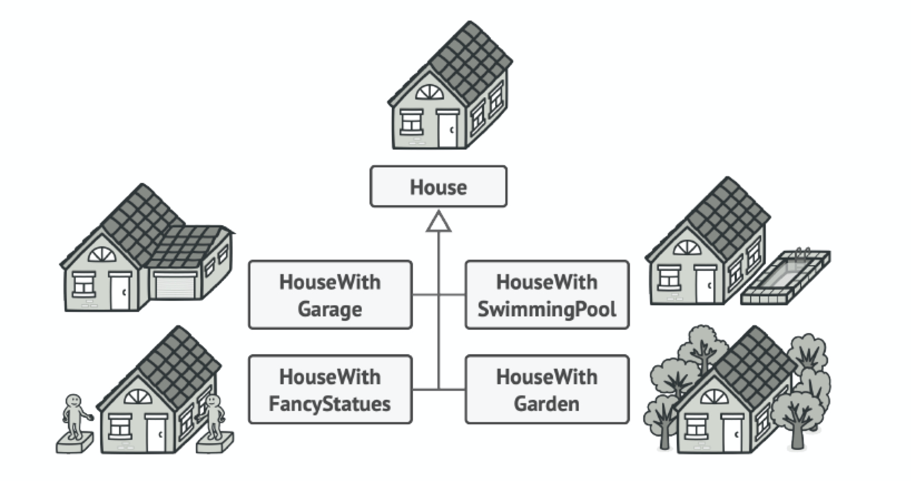
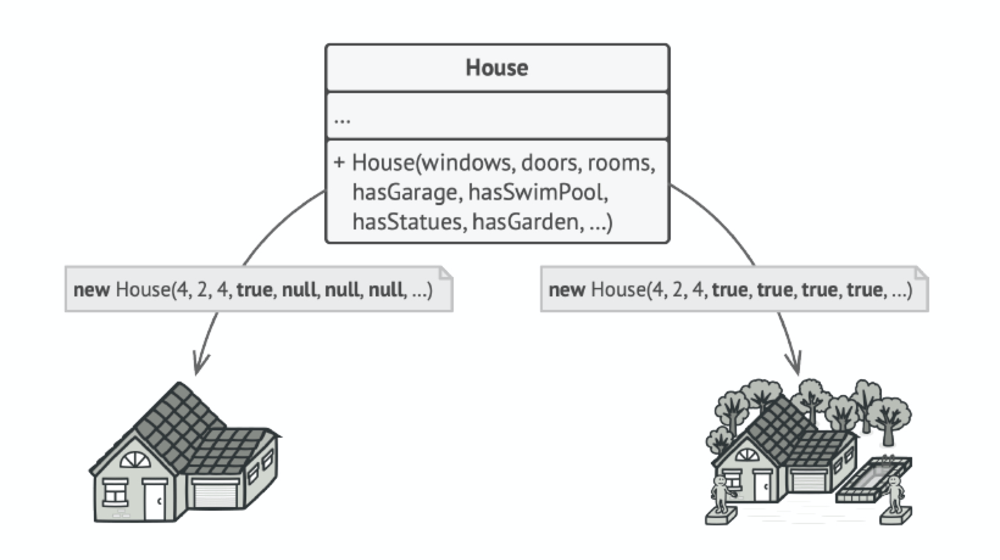
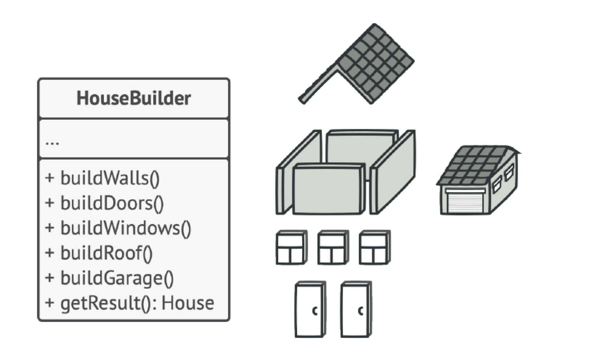
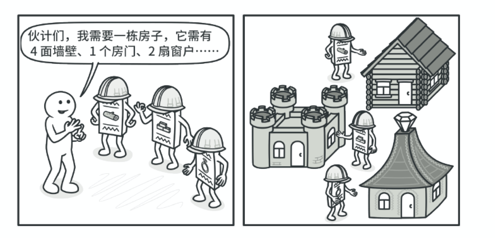
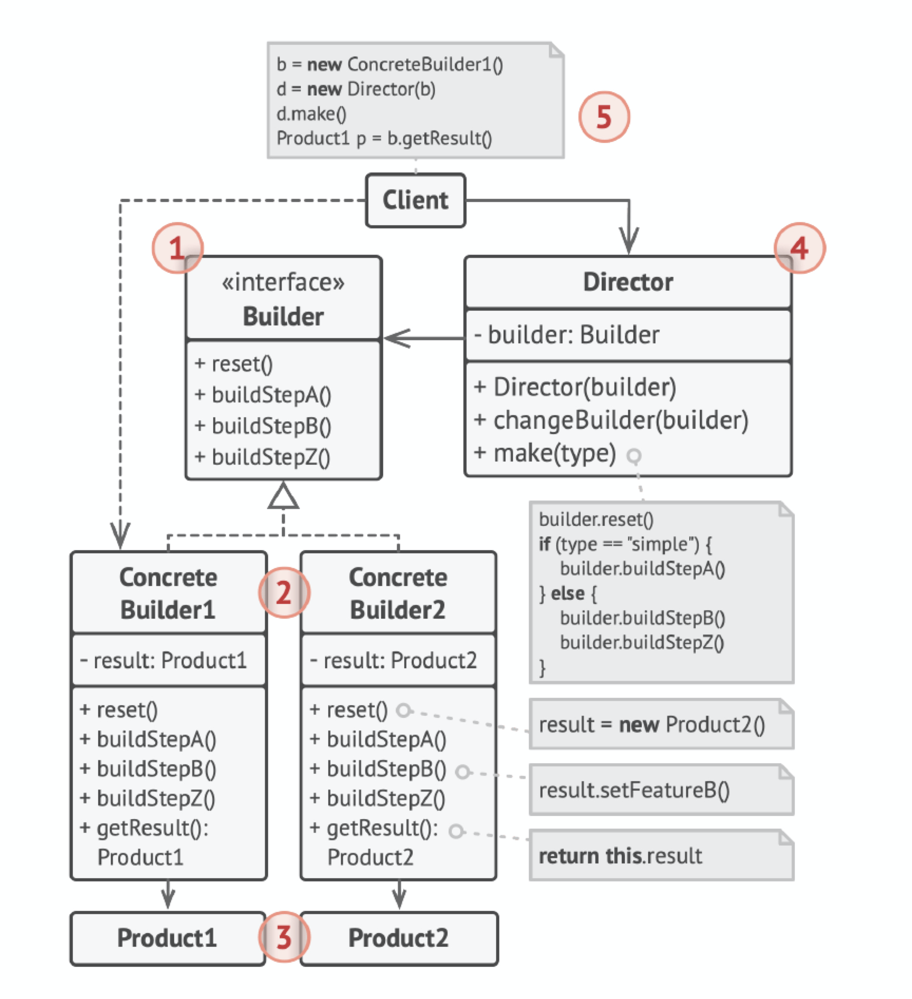

# 生成器模式（Builder）

## 定义

生成器是一种创建型设计模式，使你能够分步骤创建复杂对象。该模式允许你使用相同的创建　代码生成不同类型和形式的对象。

## 前言

#### 1. 问题

假设有这样一个复杂对象，在对其进行构造时需要对诸多成员变量和嵌套对象进行繁复的初始化工作。这些初始化代码通常深藏于一个包含众多参数且让人基本看不懂的构造函数中；甚至还有更糟糕的情况，那就是这些代码散落在客户端代码的多个位置。

如果为每种可能的对象都创建一个子类，这可能导致程序过于复杂：



例如， 我们来思考如何创建一个房屋（House）对象。建造一栋简单的房屋，首先你需要建造四面墙和地板，安装房门和一套窗户，然后再建造一个屋顶。但是如果你想要一栋更宽敞更明亮的房屋，还要有院子和其他设施（例如暖气、排水和供电设备），那又该怎么办呢？

最简单的方法是扩展房屋基类，然后创建一系列涵盖所有参数组合的子类。但最终你将面对相当数量的子类。任何新增的参数（例如门廊类型）都会让这个层次结构更加复杂。

另一种方法则无需生成子类。你可以在房屋“基类”中创建一个包括所有可能参数的超级构造函数，并用它来控制房屋对象。这种方法确实可以避免生成子类，但它却会造成另外一个问题（这些大量的参数不是每次都要全部用上的）。



通常情况下绝大部分的参数都没有使用，这**对于构造函数的调用十分不简洁**。例如，只有很少的房子有游泳池，因此与游泳池相关的参数十之八九是毫无用处的。

#### 2. 解决方案

生成器模式建议将对象构造代码从产品类中抽取出来，并将其放在一个名为生成器的独立对象中。

> 生成器模式能让你分步骤创建复杂对象，生成器不允许其他对象访问正在创建中的产品。



该模式会将对象构造过程划分为一组步骤， 比如创建墙壁（buildWalls）和创建房门（buildDoor）等。每次创建对象时，你都需要通过生成器对象执行一系列

步骤。**重点在于你无需调用所有步骤，而只需调用创建特定对象配置所需的那些步骤即可**。

当你需要创建不同形式的产品时，其中的一些构造步骤可能需要不同的实现。例如，木屋的房门可能需要使用木头制造，而城堡的房门则必须使用石头制造。

在这种情况下，你可以创建多个不同的生成器，用不同方式实现一组相同的创建步骤。然后你就可以在创建过程中使用这些生成器（例如按顺序调用多个构造步骤）来生成不同类型的对象。



例如，假设第一个建造者使用木头和玻璃制造房屋，第二个建造者使用石头和钢铁， 而第三个建造者使用黄金和钻石。在调用同一组步骤后， 第一个建造者会给你一栋普通房屋，第二个会给你一座小城堡，而第三个则会给你一座宫殿。但是，只有在调用构造步骤的客户端代码可以通过通用接口与建造者进行交互时，这样的调用才能返回需要的房屋。

## 结构



1. 生成器（Builder）接口声明在所有类型生成器中通用的产品构造步骤。
2. 具体生成器（Concrete Builders）提供构造过程的不同实现。具体生成器也可以构造不遵循通用接口的产品。
3. 产品（Products）是最终生成的对象。由不同生成器构造的产品无需属于同一类层次结构或接口。
4. 主管（Director）类定义调用构造步骤的顺序，这样你就可以创建和复用特定的产品配置。
5. 客户端（Client）必须将某个生成器对象与主管类关联。一般情况下，你只需通过主管类构造函数的参数进行一次性关联即可。此后主管类就能使用生成器对象完成后续所有的构造任务。但在客户端将生成器对象传递给主管类制造方法时还有另一种方式。在这种情况下，你在使用主管类生产产品时每次都可以使用不同的生成器。

## 适用场景

* 使用生成器模式可避免“重叠构造函数（telescopicconstructor）”的出现。

假设你的构造函数中有十个可选参数，那么调用该函数会非常不方便；因此，你需要重载这个构造函数，新建几个只有较少参数的简化版。但这些构造函数仍需调用主构造函数，传递一些默认数值来替代省略掉的参数。生成器模式让你可以分步骤生成对象，而且允许你仅使用必须的步骤。应用该模式后，你再也不需要将几十个参数塞进构造函数里了。

* 当你希望使用代码创建不同形式的产品（例如石头或木头房屋）时，可使用生成器模式。

如果你需要创建的各种形式的产品，它们的制造过程相似且仅有细节上的差异，此时可使用生成器模式。基本生成器接口中定义了所有可能的制造步骤，具体生成器将实现这些步骤来制造特定形式的产品。同时，主管类将负责管理制造步骤的顺序。

* 使用生成器构造组合树或其他复杂对象。

生成器模式让你能分步骤构造产品。你可以延迟执行某些步骤而不会影响最终产品。你甚至可以递归调用这些步骤，这在创建对象树时非常方便。生成器在执行制造步骤时，不能对外发布未完成的产品。这可以避免客户端代码获取到不完整结果对象的情况。

## 实现方法

1. 清晰地定义通用步骤， 确保它们可以制造所有形式的产品。否则你将无法进一步实施该模式。
2. 在基本生成器接口中声明这些步骤。
3. 为每个形式的产品创建具体生成器类，并实现其构造步骤。不要忘记实现获取构造结果对象的方法。你不能在生成器接口中声明该方法，因为不同生成器构造的产品可能没有公共接口，因此你就不知道该方法返回的对象类型。但是，如果所有产品都位于单一类层次中，你就可以安全地在基本接口中添加获取生成对象的方法。
4. 考虑创建主管类。它可以使用同一生成器对象来封装多种构造产品的方式。
5. 客户端代码会同时创建生成器和主管对象。构造开始前，客户端必须将生成器对象传递给主管对象。通常情况下，客户端只需调用主管类构造函数一次即可。主管类使用生成器对象完成后续所有制造任务。还有另一种方式，那就是客户端可以将生成器对象直接传递给主管类的制造方法。
6. 只有在所有产品都遵循相同接口的情况下，构造结果可以直接通过主管类获取。否则，客户端应当通过生成器获取构造结果。

## 优点

* 你可以分步创建对象，暂缓创建步骤或递归运行创建步骤。
* 生成不同形式的产品时，你可以复用相同的制造代码。
* 单一职责原则。你可以将复杂构造代码从产品的业务逻辑中分离出来。

## 缺点

由于该模式需要新增多个类，因此代码整体复杂程度会有所增加。

## 与其他模式的关系

* 在许多设计工作的初期都会使用工厂方法（较为简单，而且可以更方便地通过子类进行定制）， 随后演化为使用抽象工厂、原型或生成器（更灵活但更加复杂）。
* 生成器重点关注如何分步生成复杂对象。抽象工厂专门用于生产一系列相关对象。抽象工厂会马上返回产品，生成器则允许你在获取产品前执行一些额外构造步骤。
* 你可以在创建复杂组合树时使用生成器，因为这可使其构造步骤以递归的方式运行。
* 你可以结合使用生成器和桥接模式： 主管类负责抽象工作，各种不同的生成器负责实现工作。
* 抽象工厂、生成器和原型都可以用单例来实现。

## 实例

Product.h：

```c++
#ifndef  PRODUCT_H_
#define  PRODUCT_H_

#include <string>
#include <iostream>

// 产品类 车
class Car {
 public:
    Car() {}
    void set_car_tire(std::string t) {
        tire_ = t;
        std::cout << "set tire: " << tire_ << std::endl;
    }
    void set_car_steering_wheel(std::string sw) {
        steering_wheel_ = sw;
        std::cout << "set steering wheel: " << steering_wheel_ << std::endl;
    }
    void set_car_engine(std::string e) {
        engine_ = e;
        std::cout << "set engine: " << engine_ << std::endl;
    }

 private:
    std::string tire_;            // 轮胎
    std::string steering_wheel_;  // 方向盘
    std::string engine_;          // 发动机

};

#endif  // PRODUCT_H_
```

Builder.h：

```c++
#ifndef  BUILDER_H_
#define  BUILDER_H_

#include "Product.h"

// 抽象建造者
class CarBuilder {
 public:
    Car getCar() {
        return car_;
    }

    // 抽象方法
    virtual void buildTire() = 0;
    virtual void buildSteeringWheel() = 0;
    virtual void buildEngine() = 0;

 protected:
    Car car_;
};

#endif  // BUILDER_H_
```

ConcreteBuilder.h：

```c++
#ifndef CONCRETE_BUILDER_H_
#define CONCRETE_BUILDER_H_

#include "Builder.h"

// 具体建造者 奔驰
class BenzBuilder : public CarBuilder {
 public:
    // 具体实现方法
    void buildTire() override {
        car_.set_car_tire("benz_tire");
    }
    void buildSteeringWheel() override {
        car_.set_car_steering_wheel("benz_steering_wheel");
    }
    void buildEngine() override {
        car_.set_car_engine("benz_engine");
    }
};

// 具体建造者 奥迪
class AudiBuilder : public CarBuilder {
 public:
    // 具体实现方法
    void buildTire() override {
        car_.set_car_tire("audi_tire");
    }
    void buildSteeringWheel() override {
        car_.set_car_steering_wheel("audi_steering_wheel");
    }
    void buildEngine() override {
        car_.set_car_engine("audi_engine");
    }
};

#endif  // CONCRETE_BUILDER_H_
```

Director.h：

```c++
#ifndef  DIRECTOR_H_
#define  DIRECTOR_H_

#include "Builder.h"

class Director {
 public:
    Director() : builder_(nullptr) {}

    void set_builder(CarBuilder *cb) {
        builder_ = cb;
    }

    // 组装汽车
    Car ConstructCar() {
        builder_->buildTire();
        builder_->buildSteeringWheel();
        builder_->buildEngine();
        return builder_->getCar();
    }

 private:
    CarBuilder* builder_;
};

#endif  // DIRECTOR_H_
```

main.cpp：

```c++
#include "Director.h"
#include "ConcreteBuilder.h"

int main() {
    // 抽象建造者(一般是动态确定的)
    CarBuilder* builder;
    // 指挥者
    Director* director = new Director();
    // 产品
    Car car;

    // 建造奔驰
    std::cout << "==========construct benz car==========" << std::endl;
    builder = new BenzBuilder();
    director->set_builder(builder);
    car = director->ConstructCar();
    delete builder;

    // 建造奥迪
    std::cout << "==========construct audi car==========" << std::endl;
    builder = new AudiBuilder();
    director->set_builder(builder);
    car = director->ConstructCar();
    delete builder;

    std::cout << "==========done==========" << std::endl;
    delete director;
}
```

编译运行：

```bash
$g++ -g main.cpp -o builder -std=c++11
$./builder 
==========construct benz car==========
set tire: benz_tire
set steering wheel: benz_steering_wheel
set engine: benz_engine
==========construct audi car==========
set tire: audi_tire
set steering wheel: audi_steering_wheel
set engine: audi_engine
==========done==========
```

