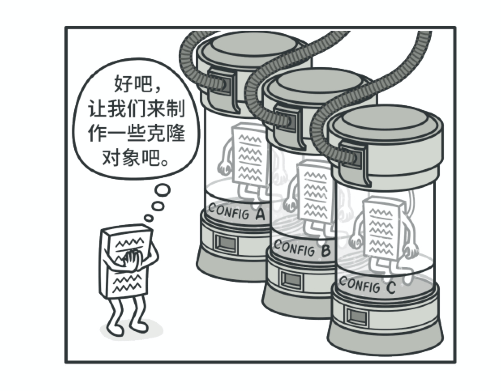
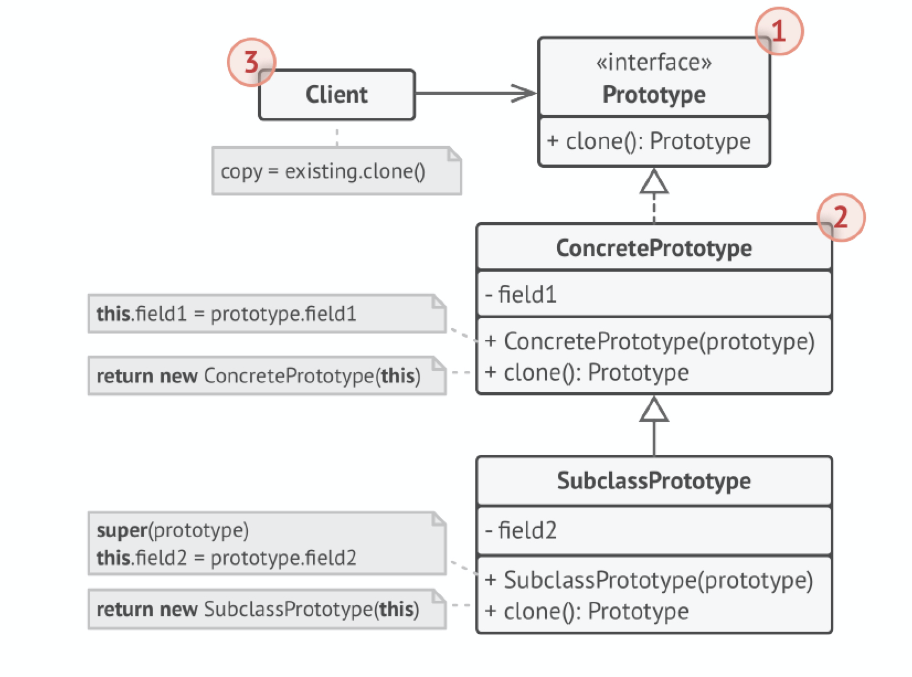
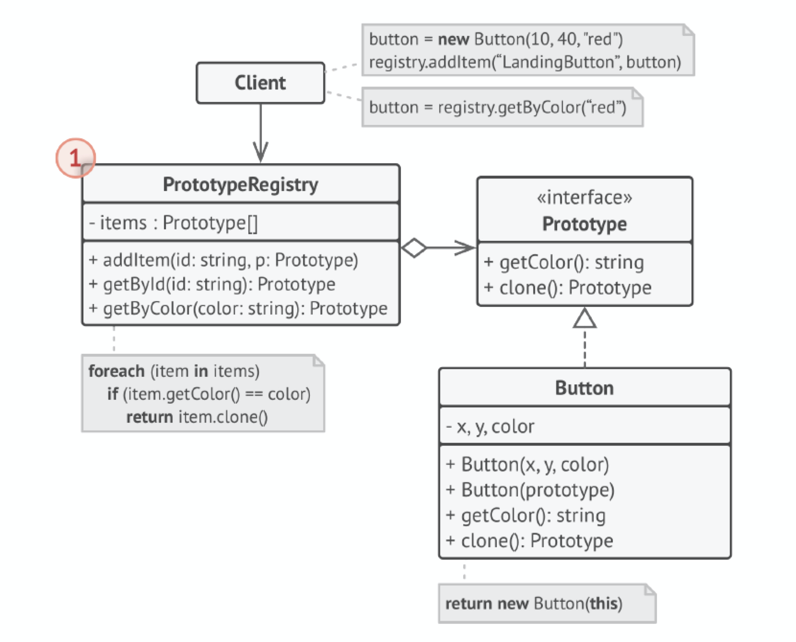

# 原型模式（Prototype）

## 定义

原型是一种创建型设计模式，使你能够复制已有对象，而又无需使代码依赖它们所属的类。

## 别名

克隆（Clone）。

## 前言

#### 1. 问题

如果你有一个对象，并希望生成与其完全相同的一个复制品，你该如何实现呢？首先，你必须新建一个属于相同类的对象。然后，你必须遍历原始对象的所有成员变量，并将成员变量值复制到新对象中。

不错！但有个小问题。并非所有对象都能通过这种方式进行复制，因为有些对象可能拥有私有成员变量，它们在对象本身以外是不可见的。

直接复制还有另外一个问题。因为你必须知道对象所属的类才能创建复制品，所以代码必须依赖该类。即使你可以接受额外的依赖性，那还有另外一个问题：有时你只知道对象所实现的接口，而不知道其所属的具体类，比如可向方法的某个参数传入实现了某个接口的任何对象。

#### 2. 解决方案

原型模式将克隆过程委派给被克隆的实际对象。模式为所有支持克隆的对象声明了一个通用接口，该接口让你能够克隆对象， 同时又无需将代码和对象所属类耦合。通常情况下，这样的接口中仅包含一个“克隆”方法。

所有的类对“克隆”方法的实现都非常相似。该方法会创建一个当前类的对象，然后将原始对象所有的成员变量值复制到新建的类中。你甚至可以复制私有成员变量，因为绝大部分编程语言都允许对象访问其同类对象的私有成员变量。

**支持克隆的对象即为原型**。当你的对象有几十个成员变量和几百种类型时，对其进行克隆甚至可以代替子类的构造。



其运作方式如下：创建一系列不同类型的对象并不同的方式对其进行配置。如果所需对象与预先配置的对象相同，那么你只需克隆原型即可，无需新建一个对象。

## 结构

#### 1. 基本实现



1. 原型（Prototype）接口将对克隆方法进行声明。在绝大多数情况下，其中只会有一个名为clone 克隆的方法。
2. 具体原型（Concrete Prototype）类将实现克隆方法。除了将原始对象的数据复制到克隆体中之外，该方法有时还需处理克隆过程中的极端情况，例如克隆关联对象和梳理递归依赖等等。
3. 客户端（Client）可以复制实现了原型接口的任何对象。

#### 2. 原型注册表实现



原型注册表（Prototype Registry）提供了一种访问常用原型的简单方法，其中存储了一系列可供随时复制的预生成对象。最简单的注册表原型是一个「名称 → 原型」的哈希表。但如果需要使用名称以外的条件进行搜索，你可以创建更加完善的注册表版本。

## 适用场景

* 如果你需要复制一些对象，同时又希望代码独立于这些对象所属的具体类，可以使用原型模式。

这一点考量通常出现在代码需要处理第三方代码通过接口传递过来的对象时。即使不考虑代码耦合的情况，你的代码也不能依赖这些对象所属的具体类，因为你不知道它们的具体信息。原型模式为客户端代码提供一个通用接口，客户端代码可通过这一接口与所有实现了克隆的对象进行交互，它也使得客户端代码与其所克隆的对象具体类独立开来。

* 如果子类的区别仅在于其对象的初始化方式，那么你可以使用该模式来减少子类的数量。别人创建这些子类的目的可能是为了创建特定类型的对象。

在原型模式中，你可以使用一系列预生成的、各种类型的对象作为原型。客户端不必根据需求对子类进行实例化，只需找到合适的原型并对其进行克隆即可。

## 实现方式

1. 创建原型接口，并在其中声明“克隆”方法。如果你已有类层次结构，则只需在其所有类中添加该方法即可。
2. 原型类必须另行定义一个以该类对象为参数的构造函数。构造函数必须复制参数对象中的所有成员变量值到新建实体中。如果你需要修改子类，则必须调用父类构造函数，让父类复制其私有成员变量值。如果编程语言不支持方法重载，那么你可能需要定义一个特殊方法来复制对象数据。在构造函数中进行此类处理比较方便，因为它在调用new 运算符后会马上返回结果对象。
3. 克隆方法通常只有一行代码： 使用new 运算符调用原型版本的构造函数。注意，每个类都必须显式重写克隆方法并使用自身类名调用new 运算符。否则， 克隆方法可能会生成父类的对象。
4. 你还可以创建一个中心化原型注册表，用于存储常用原型。你可以新建一个工厂类来实现注册表，或者在原型基类中添加一个获取原型的静态方法。该方法必须能够根据客户端代码设定的条件进行搜索。搜索条件可以是简单的字符串，或者是一组复杂的搜索参数。找到合适的原型后，注册表应对原型进行克隆，并将复制生成的对象返回给客户端。最后还要将对子类构造函数的直接调用替换为对原型注册表工厂方法的调用。

## 优点

* 你可以克隆对象，而无需与它们所属的具体类相耦合。
* 你可以克隆预生成原型，避免反复运行初始化代码。
* 你可以更方便地生成复杂对象。
* 你可以用继承以外的方式来处理复杂对象的不同配置。

## 缺点

克隆包含循环引用的复杂对象可能会非常麻烦。

## 与其他模式的关系

* 在许多设计工作的初期都会使用工厂方法（较为简单，而且可以更方便地通过子类进行定制）， 随后演化为使用抽象工厂、原型或生成器（更灵活但更加复杂）。
* 抽象工厂模式通常基于一组工厂方法，但你也可以使用原型模式来生成这些类的方法。
* 原型可用于保存命令的历史记录。
* 大量使用组合和装饰的设计通常可从对于原型的使用中获益。你可以通过该模式来复制复杂结构，而非从零开始重新构造。
* 原型并不基于继承，因此没有继承的缺点。另一方面，原型需要对被复制对象进行复杂的初始化。工厂方法基于继承，但是它不需要初始化步骤。
* 有时候原型可以作为备忘录的一个简化版本，其条件是你需要在历史记录中存储的对象的状态比较简单，不需要链接其他外部资源，或者链接可以方便地重建。
* 抽象工厂、生成器和原型都可以用单例来实现。

## 实例

Prototype.h：

```c++
#ifndef PROTOTYPE_H_
#define PROTOTYPE_H_

// 抽象原型类
class Object {
 public:
    virtual Object* clone() = 0;
};

#endif  // PROTOTYPE_H_
```

ConcretePrototype.h：

```c++
#ifndef CONCRETE_PROTOTYPE_H_
#define CONCRETE_PROTOTYPE_H_

#include <iostream>
#include <string>
#include "Prototype.h"


// 邮件的附件
class Attachment {
 public:
    void set_content(std::string content) {
        content_ = content;
    }
    std::string get_content() {
        return content_;
    }

 private:
    std::string content_;
};

// 具体原型: 邮件类
class Email : public Object {
 public:
    Email() {}
    Email(std::string text, std::string attachment_content) : text_(text), attachment_(new Attachment()) {
        attachment_->set_content(attachment_content);
    }
    ~Email() {
        if (attachment_ != nullptr) {
            delete attachment_;
            attachment_ = nullptr;
        }
    }

    void display() {
        std::cout << "------------查看邮件------------" << std::endl;
        std::cout << "正文: " << text_ << std::endl;
        std::cout << "邮件: " << attachment_->get_content() << std::endl;
        std::cout << "------------查看完毕------------" << std::endl;
    }

    // 深拷贝
    Email* clone() override {
        return new Email(this->text_, this->attachment_->get_content());
    }

    void changeText(std::string new_text) {
        text_ = new_text;
    }

    void changeAttachment(std::string content) {
        attachment_->set_content(content);
    }

 private:
    std::string text_;
    Attachment *attachment_ = nullptr;
};

#endif  // CONCRETE_PROTOTYPE_H_
```

main.cpp：

```c++
#include "ConcretePrototype.h"

#include <cstdio>

int main() {
    Email* email = new Email("最初的文案", "最初的附件");
    Email* copy_email = email->clone();
    copy_email->changeText("新文案");
    copy_email->changeAttachment("新附件");
    std::cout << "original email:" << std::endl;
    email->display();
    std::cout << "copy email:" << std::endl;
    copy_email->display();

    delete email;
    delete copy_email;
}
```

编译运行：

```bash
$g++ -g main.cpp -o prototype -std=c++11
$./prototype 
original email:
------------查看邮件------------
正文: 最初的文案
邮件: 最初的附件
------------查看完毕------------
copy email:
------------查看邮件------------
正文: 新文案
邮件: 新附件
------------查看完毕------------
```

