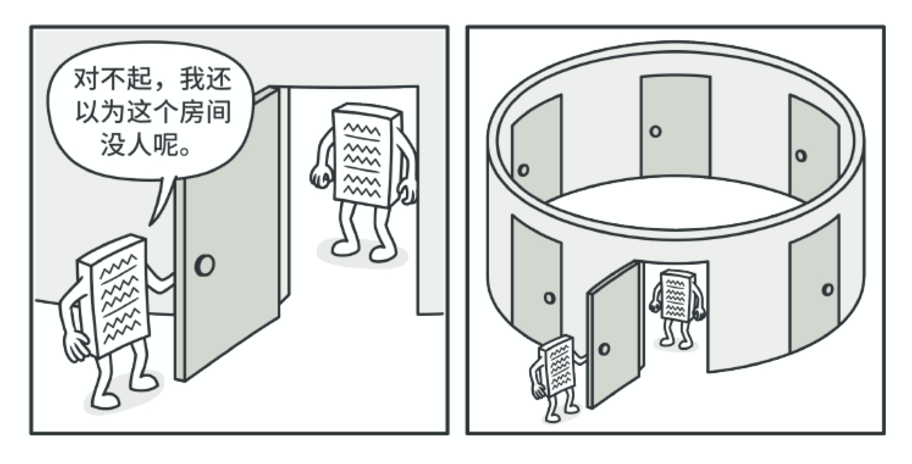
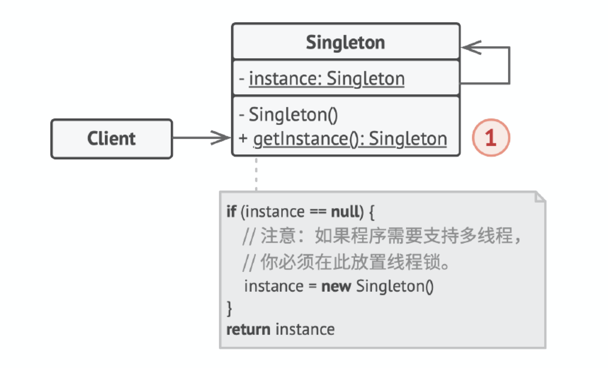

# 单例模式（Singleton）

## 定义

单例是一种创建型设计模式，让你能够保证一个类只有一个实例，并提供一个访问该实例的全局节点。

## 前言

#### 1. 问题

单例模式同时解决了两个问题，所以违反了单一职责原则：

1. 保证一个类只有一个实例。
2. 为该实例提供一个全局访问节点。

为什么会有人想要控制一个类所拥有的实例数量？最常见的原因是控制某些共享资源（例如数据库或文件）的访问权限。它的运作方式是这样的：如果你创建了一个对象，同时过一会儿后你决定再创建一个新对象，此时你会获得之前已创建的对象，而不是一个新对象。

注意，普通构造函数无法实现上述行为，因为构造函数的设计决定了它必须总是返回一个新对象。



还记得你用过的那些存储重要对象的全局变量吗？它们在使用上十分方便，但同时也非常不安全，因为任何代码都有可能覆盖掉那些变量的内容，从而引发程序崩溃。和全局变量一样，单例模式也允许在程序的任何地方访问特定对象。但是它可以保护该实例不被其他代码覆盖。

还有一点：你不会希望解决同一个问题的代码分散在程序各处的。因此更好的方式是将其放在同一个类中，特别是当其他代码已经依赖这个类时更应该如此。

如今，单例模式已经变得非常流行，以至于人们会将只解决上文描述中任意一个问题的东西称为单例。

#### 2. 解决方案

所有单例的实现都包含以下两个相同的步骤：

* 将默认构造函数设为私有， 防止其他对象使用单例类的new运算符。
* 新建一个静态构建方法作为构造函数。该函数会“偷偷”调用私有构造函数来创建对象，并将其保存在一个静态成员变量中。此后所有对于该函数的调用都将返回这一缓存对象。

如果你的代码能够访问单例类，那它就能调用单例类的静态方法。无论何时调用该方法，它总是会返回相同的对象。

## 结构



单例（Singleton） 类声明了一个名为getInstance 获取实例的静态方法来返回其所属类的一个相同实例。

单例的构造函数必须对客户端（Client） 代码隐藏。调用获取实例方法必须是获取单例对象的唯一方式。

## 适用场景

* 如果程序中的某个类对于所有客户端只有一个可用的实例，可以使用单例模式。

单例模式禁止通过除特殊构建方法以外的任何方式来创建自身类的对象。该方法可以创建一个新对象，但如果该对象已经被创建，则返回已有的对象。

* 如果你需要更加严格地控制全局变量，可以使用单例模式。

单例模式与全局变量不同，它保证类只存在一个实例。除了单例类自己以外，无法通过任何方式替换缓存的实例。请注意， 你可以随时调整限制并设定生成单例实例的数量，只需修改获取实例方法， 即getInstance 中的代码即可实现。

## 实现方式

1. 在类中添加一个私有静态成员变量用于保存单例实例。
2. 声明一个公有静态构建方法用于获取单例实例。
3. 在静态方法中实现"延迟初始化"。该方法会在首次被调用时创建一个新对象，并将其存储在静态成员变量中。此后该方法每次被调用时都返回该实例。
4. 将类的构造函数设为私有。类的静态方法仍能调用构造函数，但是其他对象不能调用。
5. 检查客户端代码，将对单例的构造函数的调用替换为对其静态构建方法的调用。

## 优点

* 你可以保证一个类只有一个实例。
* 你获得了一个指向该实例的全局访问节点。
* 仅在首次请求单例对象时对其进行初始化。

## 缺点

* 违反了单一职责原则。该模式同时解决了两个问题。
* 单例模式可能掩盖不良设计，比如程序各组件之间相互了解过多等。
* 该模式在多线程环境下需要进行特殊处理，避免多个线程多次创建单例对象。
* 单例的客户端代码单元测试可能会比较困难，因为许多测试框架以基于继承的方式创建模拟对象。由于单例类的构造函数是私有的，而且绝大部分语言无法重写静态方法，所以你需要想出仔细考虑模拟单例的方法。要么干脆不编写测试代码，或者不使用单例模式。

## 与其他模式的关系

* 外观类通常可以转换为单例类，因为在大部分情况下一个外观对象就足够了。
* 如果你能将对象的所有共享状态简化为一个享元对象，那么享元就和单例类似了。但这两个模式有两个根本性的不同。
  * 只会有一个单例实体，但是享元类可以有多个实体，各实体的内在状态也可以不同。
  * 单例对象可以是可变的。享元对象是不可变的。
* 抽象工厂、生成器和原型都可以用单例来实现。

## 懒汉单例模式代码

#### 1. 线程不安全的懒汉单例模式

> 注意懒汉模式在不加锁情况下是线程不安全的。

Singleton.h：

* 构造函数私有：即单例模式只能在内部私有化
* 实例对象static：保证全局只有一个
* 外界通过`GetInstance()`获取实例对象

```c++
#ifndef SINGLETON_H_
#define SINGLETON_H_

#include <iostream>
#include <string>

class Singleton {
 public:
    static Singleton* GetInstance() {
        if (instance_ == nullptr) {
            instance_ = new Singleton();
        }
        return instance_;
    }
 private:
    Singleton() {}
    static Singleton* instance_;
};

#endif  // SINGLETON_H_
```

Singleton.cpp：

```c++
#include "Singleton.h"

// 静态变量instance初始化不要放在头文件中, 如果多个文件包含singleton.h会出现重复定义问题
Singleton* Singleton::instance_ = nullptr;
```

main.cpp：

```c++
#include <iostream>
#include "Singleton.h"

int main() {
    Singleton *s1 = Singleton::GetInstance();
    Singleton *s2 = Singleton::GetInstance();

    std::cout << "s1地址: " << s1 << std::endl;
    std::cout << "s2地址: " << s2 << std::endl;
    return 0;
}
```

编译运行：

```bash
$g++ -g main.cpp Singleton.cpp -std=c++11 -o singleton
$./singleton 
s1地址: 0x95a040
s2地址: 0x95a040
```

#### 2. 线程安全的懒汉单例模式

上述代码并不是线程安全的，当多个线程同时调用`Singleton::GetInstance()`，可能会创建多个实例从而导致内存泄漏（会new多次但我们只能管理唯一的一个`instance_`），我们这里简单通过互斥锁实现线程安全。

Singleton.h：

```c++
#ifndef SINGLETON_H_
#define SINGLETON_H_

#include <iostream>
#include <string>
#include <mutex>

class Singleton {
 public:
    static Singleton* GetInstance() {
        if (instance_ == nullptr) {
            // 加锁保证多个线程并发调用getInstance()时只会创建一个实例
            m_mutex_.lock();
            if (instance_ == nullptr) {
                instance_ = new Singleton();
            }
            m_mutex_.unlock();
        }
        return instance_;
    }
 private:
    Singleton() {}
    static Singleton* instance_;
    static std::mutex m_mutex_;
};

#endif  // SINGLETON_H_
```

Singleton.cpp：

```c++
#include "Singleton.h"

// 静态变量instance初始化不要放在头文件中, 如果多个文件包含singleton.h会出现重复定义问题
Singleton* Singleton::instance_ = nullptr;
std::mutex Singleton::m_mutex_;
```

main.cpp：

```c++
#include <iostream>
#include "Singleton.h"

int main() {
    Singleton *s1 = Singleton::GetInstance();
    Singleton *s2 = Singleton::GetInstance();

    std::cout << "s1地址: " << s1 << std::endl;
    std::cout << "s2地址: " << s2 << std::endl;
    return 0;
}
```

## 饿汉单例模式代码

Singleton.h：

```c++
#ifndef SINGLETON_H_
#define SINGLETON_H_

class Singleton {
 public:
    static Singleton* GetInstance() {
        return instance_;
    }

 private:
    Singleton() {}
    static Singleton* instance_;
};

#endif  // SINGLETON_H_
```

Singleton.cpp：

```c++
#include "Singleton.h"

Singleton* Singleton::instance_ = new Singleton();
```

main.cpp：

```c++
#include <iostream>
#include "Singleton.h"

int main() {
    Singleton *s1 = Singleton::GetInstance();
    Singleton *s2 = Singleton::GetInstance();

    std::cout << "s1地址: " << s1 << std::endl;
    std::cout << "s2地址: " << s2 << std::endl;
    return 0;
}
```

编译运行：

```bash
$g++ -g main.cpp Singleton.cpp -std=c++11 -o singleton
$./singleton 
s1地址: 0x18a8040
s2地址: 0x18a8040
```

## Reference

[1] https://zhuanlan.zhihu.com/p/94877789

[2] https://blog.csdn.net/sinat_21107433/article/details/102649056

[3] https://design-patterns.readthedocs.io/zh_CN/latest/creational_patterns/singleton.html