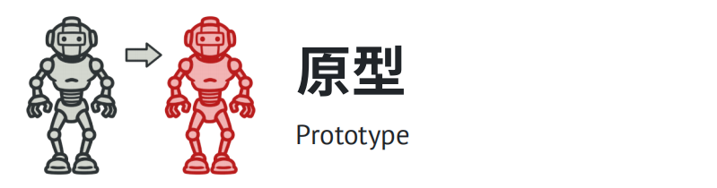

# 创建型模式

## 简介

创建型模式（Creational Pattern）对类的实例化过程进行了抽象，能够将软件模块中对象的创建和对象的使用分离。为了使软件的结构更加清晰，外界对于这些对象只需要知道它们共同的接口，而不清楚其具体的实现细节，使整个系统的设计更加符合单一职责原则。

创建型模式在创建什么（What），由谁创建（Who），何时创建（When）等方面都为软件设计者提供了尽可能大的灵活性。创建型模式隐藏了类的实例的创建细节，通过隐藏对象如何被创建和组合在一起达到使整个系统独立的目的。

## 包含模式

#### 1. 工厂方法模式

在父类中提供一个创建对象的接口以允许子类决定实例化对象的类型。

#### 2. 抽象工厂模式

让你能创建一系列相关的对象，而无需指定其具体类。

#### 3. 生成器模式

使你能够分步骤创建复杂对象。该模式允许你使用相同的创建代码生成不同类型和形式的对象。

#### 4. 原型模式

让你能够复制已有对象，而又无需使代码依赖它们所属的类。

#### 5. 单例模式

让你能够保证一个类只有一个实例，并提供一个访问该实例的全局节点。

## Reference

[1] https://design-patterns.readthedocs.io/zh_CN/latest/creational_patterns/creational.html