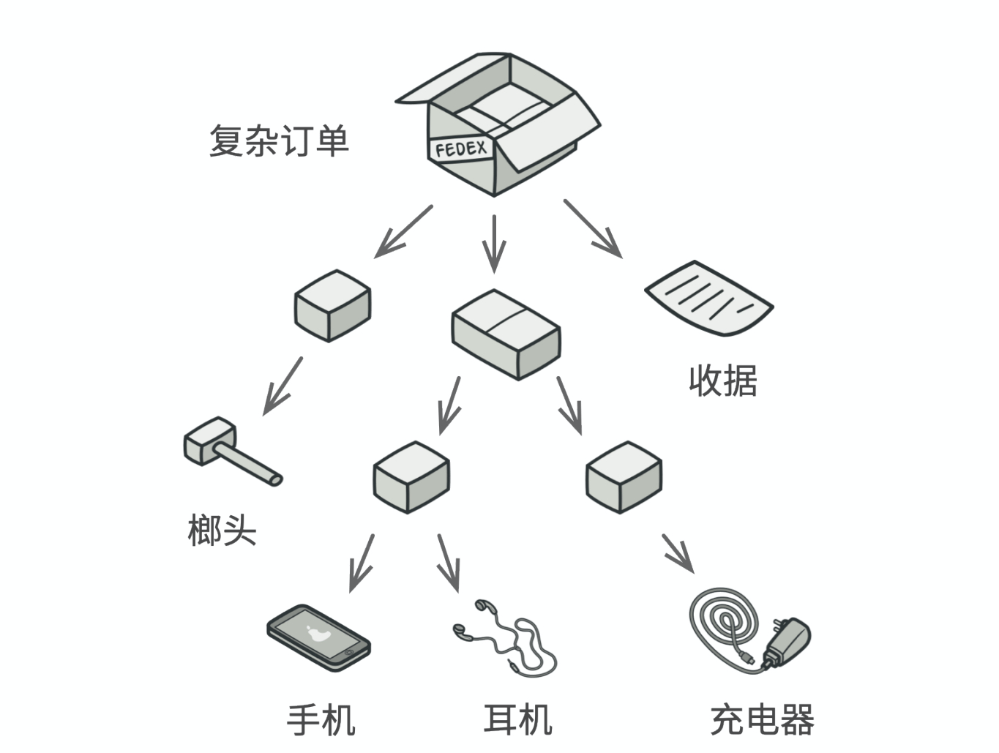
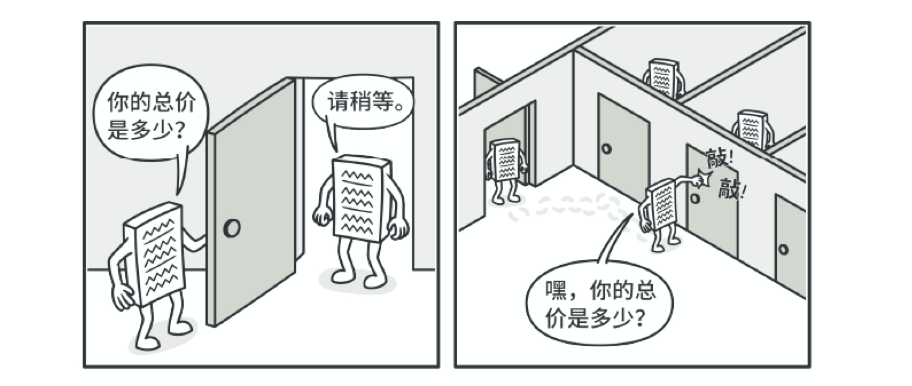
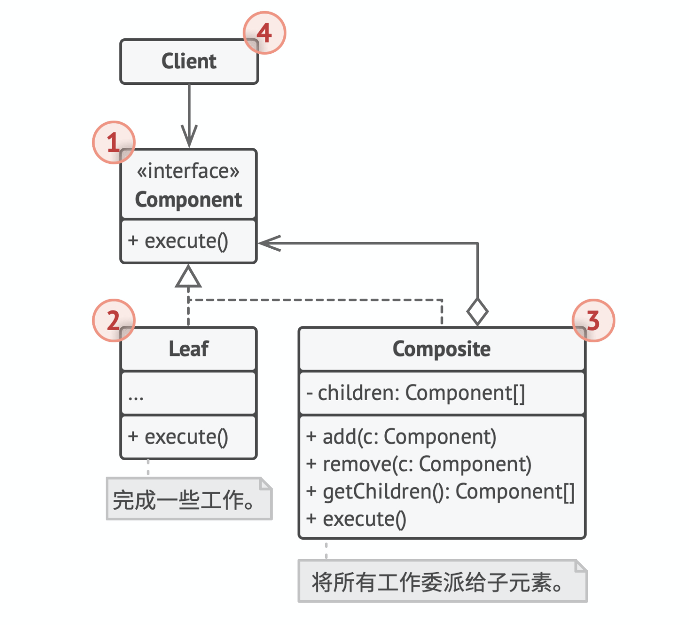

# 组合模式（Composite）

## 别名

对象树（Object Tree）。

## 定义

组合是一种结构型设计模式，你可以使用它将对象组合成树状结构，并且能像使用独立对象一样使用它们。

## 前言

#### 1. 问题

如果应用的核心模型能用树状结构表示，在应用中使用组合模式才有价值。

例如你有两类对象：产品和盒子。一个盒子中可以包含多个产品或者几个较小的盒子。这些小盒子中同样可以包含一些产品或者更小的盒子。

假设你希望在这些类的基础上开发一个订购系统。订单中可以包含无包装的简单产品，也可以包含装满产品的盒子。此时你会如何计算每张订单的总价格呢？



从上图可以看出，订单中可能包括各种产品，这些产品放置在盒子中，然后又被放入一层又一层更大的盒子总。整个结构看上去像是一棵倒过来的树。

#### 2. 解决方案

组合模式建议使用一个通用结构来与「产品」和「盒子」进行交互，并且在该接口中声明一个计算总价的方法：

* 对于一个具体产品，该方法直接返回其价格
* 对于一个盒子，该方法遍历盒子中的所有项目，返回该盒子的总价格



该方法的最大优点在于你无需了解构成树状结构的对象的具体类。你也无需了解对象是简单的产品还是复杂的盒子。你只需要调用通用接口以相同的方式对其进行处理即可。当你调用该方法后，对象会将请求沿着树结构传递下去。

## 结构



1. 组件（Component）接口描述了树中简单项目和复杂项目所共有的操作。
2. 叶节点（Leaf）是树的基本结构，它不包含子项目。一般情况下，叶节点最终会完成大部分的实际工作，因为它们无法将工作指派给其他部分。
3. 容器（Container）——又名“组合（Composite）”——是包含叶节点或其他容器等子项目的单位。容器不知道其子项目所属的具体类，它只通过通用的组件接口与其子项目交互。容器接收到请求后会将工作分配给自己的子项目，处理中间结果，然后将最终结果返回给客户端。
4. 客户端（Client）通过组件接口与所有项目交互。因此， 客户端能以相同方式与树状结构中的简单或复杂项目交互。

## 适用场景

* 如果你需要实现树状对象结构，可以使用组合模式。

组合模式为你提供了两种共享公共接口的基本元素类型：简单叶节点和复杂容器。容器中可以包含叶节点和其他容器。这使得你可以构建树状嵌套递归对象结构。

* 如果你希望客户端代码以相同方式处理简单和复杂元素，可 以使用该模式。

组合模式中定义的所有元素共用同一个接口。在这一接口的帮助下，客户端不必在意其所使用的对象的具体类。

## 实现方式

1. 确保应用的核心模型能够以树状结构表示。尝试将其分解为简单元素和容器。记住，容器必须能够同时包含简单元素和其他容器。
2. 声明组件接口及其一系列方法，这些方法对简单和复杂元素都有意义。
3. 创建一个叶节点类表示简单元素。程序中可以有多个不同的叶节点类。
4. 创建一个容器类表示复杂元素。在该类中，创建一个数组成员变量来存储对于其子元素的引用。该数组必须能够同时保存叶节点和容器，因此请确保将其声明为组合接口类型。实现组件接口方法时，记住容器应该将大部分工作交给其子元素来完成。
5. 最后，在容器中定义添加和删除子元素的方法。记住，这些操作可在组件接口中声明。这将会违反「接口隔离原则」，因为叶节点类中的这些方法为空。但是，这可以让客户端无差别地访问所有元素，即使是组成树状结构的元素。

## 优点

* 你可以利用多态和递归机制更方便地使用复杂树结构。
* 开闭原则。无需更改现有代码，你就可以在应用中添加新元素，使其成为对象树的一部分。

## 缺点

对于功能差异较大的类，提供公共接口或许会有困难。在特定情况下，你需要过度一般化组件接口，使其变得令人难以理解。

## 与其他模式的关系

*  桥接、状态和策略（在某种程度上包括适配器）模式的接口非常相似。实际上，它们都基于组合模式——即将工作委派给其他对象，不过也各自解决了不同的问题。模式并不只是以特定方式组织代码的配方，你还可以使用它们来和其他开发者讨论模式所解决的问题。
*  你可以在创建复杂组合树时使用生成器，因为这可使其构造步骤以递归的方式运行。
*  责任链通常和组合模式结合使用。在这种情况下，叶组件接收到请求后，可以将请求沿包含全体父组件的链一直传递至对象树的底部。
*  你可以使用迭代器来遍历组合树。
*  你可以使用访问者对整个组合树执行操作。
*  你可以使用享元实现组合树的共享叶节点以节省内存。
*  组合和装饰的结构图很相似，因为两者都依赖递归组合来组织无限数量的对象。装饰类似于组合，但其只有一个子组件。此外还有一个明显不同：装饰为被封装对象添加了额外的职责，组合仅对其子节点的结果进行了“求和”。但是，模式也可以相互合作：你可以使用装饰来扩展组合树中特定对象的行为。
*  大量使用组合和装饰的设计通常可从对于原型的使用中获益。你可以通过该模式来复制复杂结构，而非从零开始重新构造。

## 实例

本例我们将借助「组合模式」帮助你在图形编辑器中实现一系列的几何图形。

组合图形（CompoundGraphic）是一个容器，它可以由多个包括容器在内的子图形构成。组合图形和简单图形拥有相同的方法。但是组合图形自身并不完成具体工作，而是将请求递归地传递给自己的子项目，然后“汇总”结果。

通过所有图形类所共有的接口，客户端代码可以与所有图形互动。因此，客户端不知道与其交互的是简单图形还是组合图形。客户端可以与非常复杂的对象结构进行交互，而无需与组成该结构的实体类紧密耦合。

Component.h：

```c++
#ifndef COMPONENT_H_
#define COMPONENT_H_

// 组件接口会声明组合中简单和复杂对象的通用操作, C++中实现成抽象基类。
class Graphic {
 public:
    virtual void move2somewhere(int x, int y) = 0;
    virtual void draw() = 0;
};

#endif  // COMPONENT_H_
```

Leaf.h：

```c++
#ifndef LEAF_H_
#define LEAF_H_

#include <cstdio>
#include "Component.h"

// 叶节点类代表组合的中断对象。叶节点对象中不能包含任何子对象。
// 叶节点对象通常会完成实际的工作, 组合对象则仅会将工作委派给自己的子部件。

// 点
class Dot : public Graphic {
 public:
    Dot(int x, int y) : x_(x), y_(y) {}
    void move2somewhere(int x, int y) override {
        x_ += x;
        y_ += y;
        return;
    }
    void draw() override {
        printf("在(%d,%d)处绘制点\n", x_, y_);
        return;
    }

 private:
    int x_;
    int y_;
};

// 圆
class Circle : public Graphic {
 public:
    explicit Circle(int r, int x, int y) : radius_(r), x_(x), y_(y) {}
    void move2somewhere(int x, int y) override {
        x_ += x;
        y_ += y;
        return;
    }
    void draw() override {
        printf("以(%d,%d)为圆心绘制半径为%d的圆\n", x_, y_, radius_);
    }

 private:
    // 半径与圆心坐标
    int radius_;
    int x_;
    int y_;
};

#endif  // LEAF_H_
```

Composite.h：

```c++
#ifndef COMPOSITE_H_
#define COMPOSITE_H_

#include <map>
#include "Component.h"

// 组合类表示可能包含子项目的复杂组件。组合对象通常会将实际工作委派给子项目，然后“汇总”结果。
class CompoundGraphic : public Graphic {
 public:
    void add(int id, Graphic* child) {
        childred_[id] = (child);
    }
    void remove(int id) {
        childred_.erase(id);
    }
    void move2somewhere(int x, int y) override {
        for (auto iter = childred_.cbegin(); iter != childred_.cend(); iter++) {
            iter->second->move2somewhere(x, y);
        }
    }
    void draw() override {
        for (auto iter = childred_.cbegin(); iter != childred_.cend(); iter++) {
            iter->second->draw();
        }
    }

 private:
    // key是图表id, value是图表指针
    std::map<int, Graphic*> childred_;
};

#endif  // COMPOSITE_H_
```

main.cpp：

```c++
#include "Composite.h"
#include "Leaf.h"

int main() {
    // 组合图
    CompoundGraphic* all = new CompoundGraphic();

    // 添加子图
    Dot* dot1 = new Dot(1, 2);
    Circle *circle = new Circle(5, 2, 2);
    CompoundGraphic* child_graph = new CompoundGraphic();
    Dot* dot2 = new Dot(4, 7);
    Dot* dot3 = new Dot(3, 2);
    child_graph->add(0, dot2);
    child_graph->add(1, dot3);

    // 将所有图添加到组合图中
    all->add(0, dot1);
    all->add(1, circle);
    all->add(2, child_graph);

    // 绘制
    all->draw();

    delete all;
    delete dot1;
    delete dot2;
    delete dot3;
    delete circle;
    return 0;
}
```

编译运行：

```bash
$g++ -g main.cpp -o composite -std=c++11
$./composite 
在(1,2)处绘制点
以(2,2)为圆心绘制半径为5的圆
在(4,7)处绘制点
在(3,2)处绘制点
```

