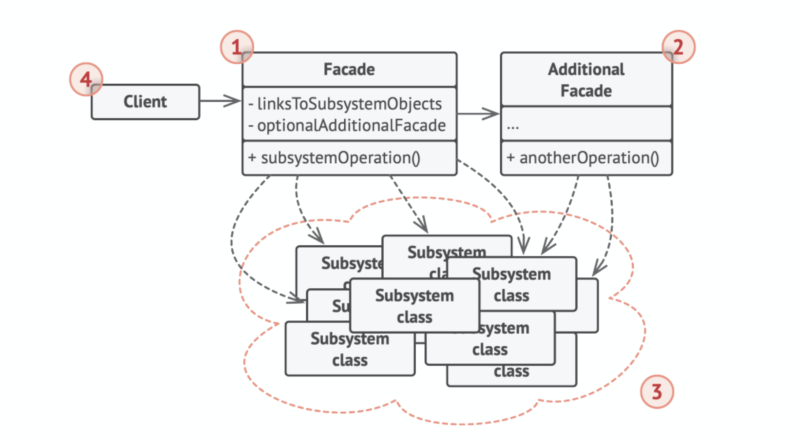

# 外观模式（Facade）

## 定义

外观是一种结构型设计模式，能为程序库、框架或其他复杂类提供一个简单的接口。

## 前言

#### 1. 问题

假设你必须在代码中使用某个复杂的库或框架中的众多对象。正常情况下，你需要负责所有对象的初始化工作、管理其依赖关系并按正确的顺序执行方法等。

最终，程序中类的业务逻辑将与第三方类的实现细节紧密耦合，使得理解和维护代码的工作很难进行。

#### 2. 解决方案

外观类为包含许多活动部件的复杂子系统提供一个简单的接口。与直接调用子系统相比，外观提供的功能可能比较有限，但它却包含了客户端真正关心的功能。

如果你的程序需要与包含几十种功能的复杂库整合，但只需使用其中非常少的功能，那么使用外观模式会非常方便。

例如， 上传猫咪搞笑短视频到社交媒体网站的应用可能会用到专业的视频转换库， 但它只需使用一个包含encode(filename, format) 方法（以文件名与文件格式为参数进行编码的方法）的类即可。在创建这个类并将其连接到视频转换库后，你就拥有了自己的第一个外观。

## 结构



1. 外观（Facade）提供了一种访问特定子系统功能的便捷方式，其了解如何重定向客户端请求，知晓如何操作一切活动部件。
2. 创建附加外观（Additional Facade） 类可以避免多种不相关的功能污染单一外观，使其变成又一个复杂结构。客户端和其他外观都可使用附加外观。
3. 复杂子系统（Complex Subsystem）由数十个不同对象构成。如果要用这些对象完成有意义的工作，你必须深入了解子系统的实现细节，比如按照正确顺序初始化对象和为其提供正确格式的数据。子系统类不会意识到外观的存在，它们在系统内运作并且相互之间可直接进行交互。
4. 客户端（Client）使用外观代替对子系统对象的直接调用。

## 适用场景

* 如果你需要一个指向复杂子系统的直接接口，且该接口的功能有限，则可以使用外观模式。

子系统通常会随着时间的推进变得越来越复杂。即便是应用了设计模式，通常你也会创建更多的类。尽管在多种情形中子系统可能是更灵活或易于复用的，但其所需的配置和样板代码数量将会增长得更快。为了解决这个问题，外观将会提供指向子系统中最常用功能的快捷方式，能够满足客户端的大部分需求。

* 如果需要将子系统组织为多层结构，可以使用外观。

创建外观来定义子系统中各层次的入口。你可以要求子系统仅使用外观来进行交互，以减少子系统之间的耦合。

让我们回到视频转换框架的例子。该框架可以拆分为两个层次：音频相关和视频相关。你可以为每个层次创建一个外观，然后要求各层的类必须通过这些外观进行交互。这种方式看上去与中介者模式非常相似。

## 实现方式

1. 考虑能否在现有子系统的基础上提供一个更简单的接口。如果该接口能让客户端代码独立于众多子系统类，那么你的方向就是正确的。
2. 在一个新的外观类中声明并实现该接口。外观应将客户端代码的调用重定向到子系统中的相应对象处。如果客户端代码没有对子系统进行初始化，也没有对其后续生命周期进行 理，那么外观必须完成此类工作。
3. 如果要充分发挥这一模式的优势，你必须确保所有客户端代码仅通过外观来与子系统进行交互。此后客户端代码将不会受到任何由子系统代码修改而造成的影响，比如子系统升级后，你只需修改外观中的代码即可。
4. 如果外观变得过于臃肿，你可以考虑将其部分行为抽取为一个新的专用外观类。

## 优点

你可以让自己的代码独立于复杂子系统。

## 缺点

外观可能成为与程序中所有类都耦合的上帝对象。

## 与其他模式的关系

* 外观为现有对象定义了一个新接口，适配器则会试图运用已有的接口。适配器通常只封装一个对象，外观通常会作用于 整个对象子系统上。
* 当只需对客户端代码隐藏子系统创建对象的方式时，你可以使用抽象工厂来代替外观。
* 享元展示了如何生成大量的小型对象，外观则展示了如何用一个对象来代表整个子系统。
* 外观和中介者的职责类似：它们都尝试在大量紧密耦合的类中组织起合作。
  * 外观为子系统中的所有对象定义了一个简单接口，但是它不提供任何新功能。子系统本身不会意识到外观的存在。 子系统中的对象可以直接进行交流。 
  * 中介者将系统中组件的沟通行为中心化。各组件只知道中介者对象，无法直接相互交流。
* 外观类通常可以转换为单例类，因为在大部分情况下一个外观对象就足够了。
* 外观与代理的相似之处在于它们都缓存了一个复杂实体并自行对其进行初始化。代理与其服务对象遵循同一接口，使得自己和服务对象可以互换，在这一点上它与外观不同。

## 实例

计算机本身是一个及其复杂的系统，我们通过外观模式屏蔽电脑开机这一动作背后复杂子系统的运作。

Facade.h：

```c++
#ifndef FACADE_H_
#define FACADE_H_

#include "SubSystem.h"

class ComputerOperator {
 public:
    ComputerOperator() {
        memory_ = new Memory();
        processor_ = new Processor();
        hard_disk_ = new HardDisk();
        os_ = new OS();
    }
    ~ComputerOperator() {
        delete memory_;
        delete processor_;
        delete hard_disk_;
        delete os_;
        memory_ = nullptr;
        processor_ = nullptr;
        hard_disk_ = nullptr;
        os_ = nullptr;
    }

    void powerOn() {
        std::cout << "正在开机..." << std::endl;
        memory_->selfCheck();
        processor_->run();
        hard_disk_->read();
        os_->load();
        std::cout << "开机成功!" << std::endl;
    }

 private:
    Memory* memory_;
    Processor* processor_;
    HardDisk* hard_disk_;
    OS* os_;
};

#endif  // FACADE_H_
```

SubSystem.h：

```c++
#ifndef SUB_SYSTEM_H_
#define SUB_SYSTEM_H_

#include<iostream>

// 内存
class Memory {
 public:
    Memory() {}
    void selfCheck() {
        std::cout << "内存自检中..." << std::endl;
        std::cout << "内存自检完成!" << std::endl;
    }
};

// 处理器
class Processor {
 public:
    Processor() {}
    void run() {
        std::cout << "启动CPU中..." << std::endl;
        std::cout << "启动CPU成功!" << std::endl;
    }
};

// 硬盘
class HardDisk {
 public:
    HardDisk() {}
    void read() {
        std::cout << "读取硬盘中..." << std::endl;
        std::cout << "读取硬盘成功!" << std::endl;
    }
};

// 操作系统
class OS {
 public:
    OS() {}
    void load() {
        std::cout << "载入操作系统中..." << std::endl;
        std::cout << "载入操作系统成功!" << std::endl;
    }
};

#endif  // SUB_SYSTEM_H_
```

main.cpp：

```c++
#include "Facade.h"

int main() {
    ComputerOperator* computer_operator = new ComputerOperator();
    computer_operator->powerOn();
    delete computer_operator;
}
```

编译运行：

```bash
$g++ -g main.cpp -std=c++11 -o facade
$./facade 
正在开机...
内存自检中...
内存自检完成!
启动CPU中...
启动CPU成功!
读取硬盘中...
读取硬盘成功!
载入操作系统中...
载入操作系统成功!
开机成功!
```

