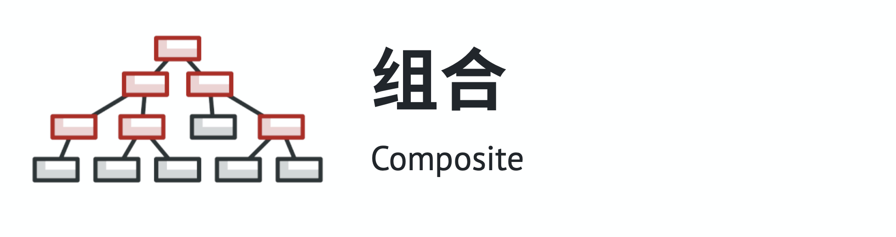

# 结构型模式

## 简介

结构型模式（Structural Pattern）描述如何将类或者对象结合在一起形成更大的结构，就像搭积木，可以通过 简单积木的组合形成复杂的、功能更为强大的结构。

结构型模式可以分为类结构型模式和对象结构型模式：

* 类结构型模式：关心类的组合，由多个类可以组合成一个更大的系统，在类结构型模式中一般只存在继承关系和实现关系

* 对象结构型模式：关心类与对象的组合，通过关联关系使得在一 个类中定义另一个类的实例对象，然后通过该对象调用其方法

根据“合成复用原则”，在系统中尽量使用关联关系来替代继 承关系，因此大部分结构型模式都是对象结构型模式。

## 包含模式

#### 1. 适配器模式

让接口不兼容的对象能够相互合作。

#### 2. 桥接模式

可将一个大类或一系列紧密相关的类拆分为抽象和实现两个独立的层次结构，从而能在开发时分别使用。

#### 3. 组合模式

你可以使用它将对象组合成树状结构，并且能像使用独立对象一样使用它们。 

#### 4. 装饰模式

允许你将对象放入包含行为的特殊封装对象中来为原对象绑定新的行为。

#### 5. 外观模式

能为程序库、框架或其他复杂类提供一个简单的接口。

#### 6. 享元模式

摒弃了再每个对象中保存所有数据的方式，通过共享多个对象所共有的相同状态，让你能在优先的内存容量中载入更多对象。

#### 7. 代理模式

让你能够提供对象的替代品或其占位符。代理控制着对于原对象的访问，并允许在将请求提交给对象前后进行一些处理。

## Reference

[1] https://design-patterns.readthedocs.io/zh_CN/latest/structural_patterns/structural.html